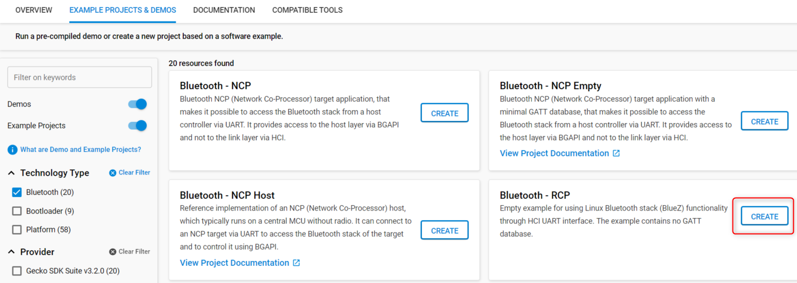
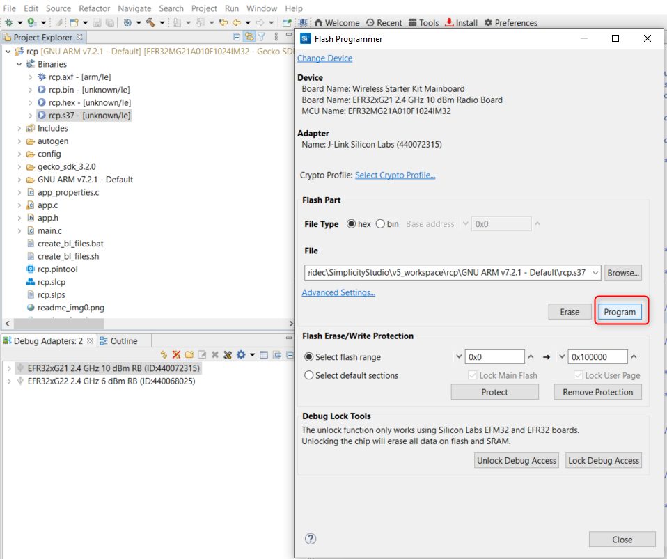
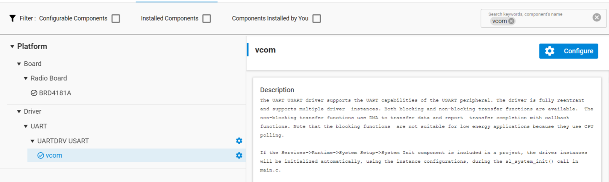
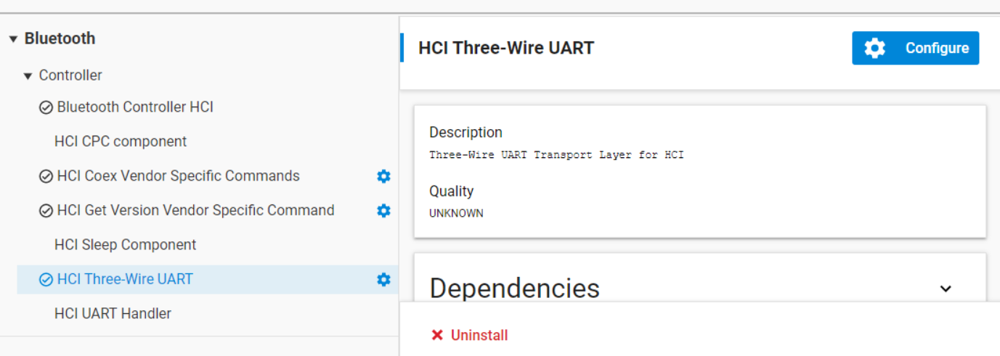
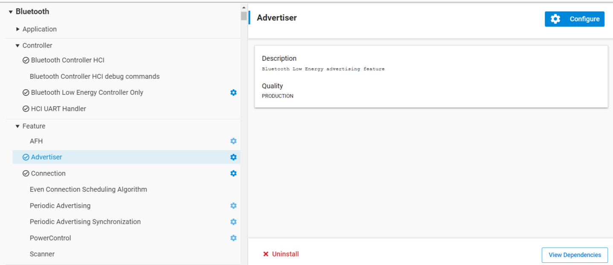
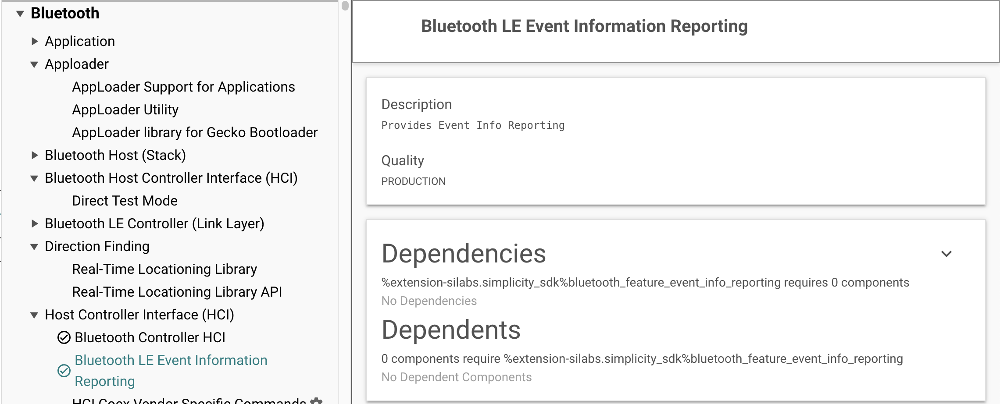

# Enabling HCI Functionality

## Using an Example Application

The Gecko SDK suite includes the **Bluetooth – RCP** and **Bluetooth – RCP CPC** example applications, which can be used to create an HCI-capable Bluetooth Controller application that can be run in RCP mode. An external Bluetooth Host protocol stack, such as Linux BlueZ, can use the Bluetooth Controller via HCI. BlueZ provides interactive control tools such as *bluetoothctl* to send HCI commands to the controller. The basic usage of *bluetoothctl* is documented in the [readme](https://github.com/SiliconLabsSoftware/sisdk-release/blob/sisdk-2025.12/bluetooth_le_app/example/bt_rcp/readme.md) of the **Bluetooth – RCP** example project.

To use the example applications, select the target device in the Debug Adapters view, find the **Bluetooth – RCP** or **Bluetooth – RCP CPC** example on the EXAMPLE PROJECTS & DEMOS tab, and create the project.

**Bluetooth – RCP** creates an RCP project that uses Bluetooth SIG’s UART (H4) transport protocol as the transport protocol.

**Bluetooth – RCP CPC** creates a project that uses Silicon Labs’ proprietary CPC (Co-Processor Communication) protocol as the transport protocol. The latter one is useful in DMP (Dynamic Multi-protocol) use cases, when the host device communicates with multiple protocol stacks running on the Radio Co-Processor, but it may also be useful if you need a robust and secure transport protocol. For more information on CPC, refer to [https://github.com/SiliconLabs/cpc-daemon/blob/main/readme.md](https://github.com/SiliconLabs/cpc-daemon/blob/main/readme.md). To learn more about the DMP use case, see [Running Zigbee, OpenThread, and Bluetooth Concurrently on a Linux Host with a Multiprotocol RCP](https://docs.silabs.com/multiprotocol/latest/multiprotocol-solution-linux/).

After building the project, flash it to the target device as with any other project:

Finally, attach the Bluetooth controller to your Bluetooth host stack using hciattach, and reset the device before issuing commands.

The application configuration can be reviewed and changed in the Project Configurator under the SOFTWARE COMPONENTS tab. To find a specific component, begin typing its name in the Search field.

## Transport layer configuration

### UART

By default, the application uses UART as the HCI Transport layer. The UART has been configured as follows.

- Hardware flow control: enabled

- Speed: 115200 kbps

- Data bits: 8

- Parity bit: N

- Stop bits: 1

The default configuration can be changed with the **vcom** component.

This will generate the values to the header file *sl\_uartdrv\_usart\_vcom\_config.h*. Especially for high-speed communication over UART, enabling hardware flow control and increasing the baud rate to 921600 is strongly recommended.  Instructions for setting the hardware flow control in the WSTKs (Wireless Starter Kits) are given in Section [Configuring Hardware Flow Control In the WSTK](./05-configuring-hardware-flow-control-in-the-wstk.md#configuring-hardware-flow-control-in-the-wstk). Similarly. the baud rate can be changed.

Note that by default nearly all HCI events sent from the controller have been filtered out. The events to be filtered or passed from the controller to host can be configured using the HCI commands *HCI\_LE\_Set\_Event\_Mask* and *HCI\_Set\_Event\_Mask*.

### Three-Wire UART

>**Note**: To use the Three-Wire UART transport layer (H5) for transmitting HCI messages instead of the default UART transport layer (H4), add the HCI Three-Wire UART software component to the project. This will add framing, software flow control, and data integrity check to the transport layer, making the communication via UART much more reliable.

To enable the Three-Wire UART transport layer instead of the UART, add the *HCI Three-Wire UART* software component to the project:

## Required Components for HCI Capable RCP Mode Application

For the basic HCI-enabled application in the RCP mode the following components are required, and are installed in the example applications by default.

- Bluetooth Low Energy Controller Only

- Bluetooth Controller HCI

- HCI UART Handler (if H4 UART transport protocol is used)

- HCI CPC component (if CPC transport protocol is used)

Other components are required to make a reasonably functional application. For example, the **Connection** and **Advertiser** components are required (and installed by default) to make an application that can advertise and accept connections. If the application should be able to accept a large number of simultaneous connections, also including the **Even Connection Scheduling Algorithm** component is useful.

Another example is to add the ability to scan near-by devices and establish connections to them. This requires the **Connection** and **Scanning** components. For the application to use the power control functionality for connections, include the **Power Control** component.

## Optional Components

Bluetooth LE event information can be reported to the host by installing the Bluetooth LE Event Information Reporting component. To enable event reporting, see the [vendor specific HCI commands.](./04-vendor-specific-hci-commands-and-events.md#vendor-specific-hci-commands)

