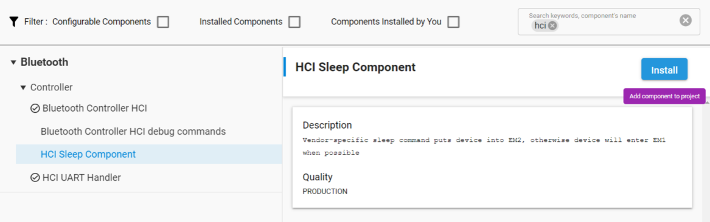

# Sleep Modes

In RCP mode two sleep modes can be activated, EM1 and EM2. To do so, install the **HCI Sleep Component**:

The device enters EM1 when it is idle and wakes from EM1 when data is received via USART.

The device enters EM2 on receiving the `HCI_VS_Silabs_Sleep` vendor-specific command, with the sleep bit set to 1. It handles all outstanding events before entering EM2.

An interrupt triggered by received GPIO data wakes the device from EM2. The first byte wakes the device but is discarded. This means that a normal HCI command cannot be used to wake a device from sleep. The recommended way is to send a “0”. If the first byte (Packet Type) is “0”, it will be discarded in other energy modes as well.

All Bluetooth activities operate normally during sleep except HCI interface reception, which is disabled during EM2.

If a host processor must be put to sleep and events prevented from being sent over the HCI interface, then it is recommended to only have Bluetooth activities operating that do not generate any events. For example, using non-connectable advertising or periodic advertising would not generate any events over the HCI. Note that advertising must not have a timeout and must not report scan requests.

Events can also be disabled by using HCI event mask commands. Depending on the masked events, these are handled by the link layer itself. See the Bluetooth Core specification for details.
