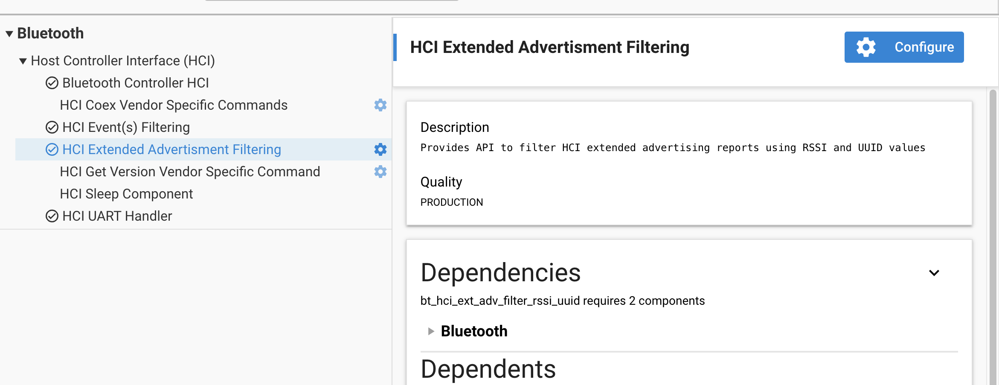
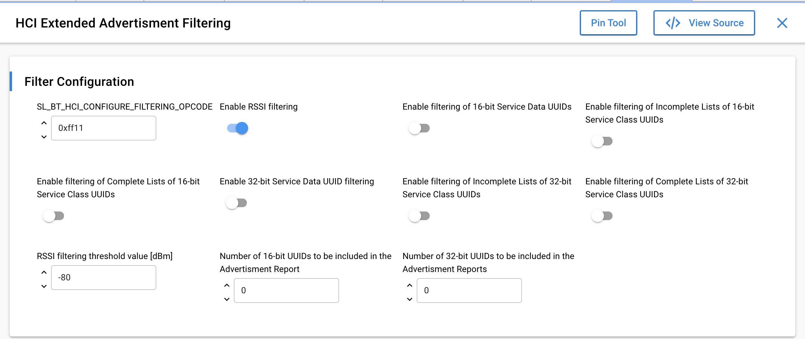

# Vendor-Specific HCI Commands and Events

The Silicon Labs HCI and Controller support some vendor-specific commands and events as described in the following two sections. Additional vendor-specific commands can also be implemented, as described in [Custom Commands](#custom-commands).

## Vendor-Specific HCI Commands

The Silicon Labs HCI and Controller support the following vendor-specific HCI commands.

- [HCI VS_SiliconLabs_Forcefully_Kill_Connection – Command](#hci-vs-siliconlabs-forcefully-kill-connection-command)

- [HCI VS_SiliconLabs_Forcefully_Kill_Connection – Command Parameters](#hci-vs-siliconlabs-forcefully-kill-connection-command-parameters)

- [HCI_VS_SiliconLabs_Set_Connection_Config_Bits – Command](#hci-vs-siliconlabs-set-connection-config-bits-command)

- [HCI_VS_SiliconLabs_Set_Connection_Config_Bits – Command Parameters](#hci-vs-siliconlabs-set-connection-config-bits-command-parameters)

- [HCI_VS_SiliconLabs_Clear_Connection_Config_Bits – Command](#hci-vs-siliconlabs-clear-connection-config-bits-command)

- [HCI_VS_SiliconLabs_Configure – Command](#hci-vs-siliconlabs-configure-command)

- [HCI_VS_SiliconLabs_Configure – Command Parameters](#hci-vs-siliconlabs-configure-command-parameters)

- [HCI_VS_SiliconLabs_Configure – Parameter Key](#hci-vs-siliconlabs-configure-parameter-key)

- [HCI_VS_SiliconLabs_Get_Timing – Command](#hci-vs-siliconlabs-get-timing-command)

- [HCI_VS_SiliconLabs_Get_Timing – Command Parameters](#hci-vs-siliconlabs-get-timing-command-parameters)

- [HCI_VS_SiliconLabs_Config_Flags – Command](#hci-vs-siliconlabs-config-flags-command)

- [HCI_VS_SiliconLabs_Config_Flags – Command Parameters](#hci-vs-siliconlabs-config-flags-command-parameters)

- [HCI_VS_SiliconLabs_Get_Counters – Command](#hci-vs-siliconlabs-get-counters-command)

- [HCI_VS_SiliconLabs_Get_Counters – Command Parameters](#hci-vs-siliconlabs-get-counters-command-parameters)

- [HCI_VS_Silabs_Sleep – Command](#hci-vs-silabs-sleep-command)

- [HCI_VS_Silabs_Sleep – Command Parameters](#hci-vs-silabs-sleep-command-parameters)

- [HCI_VS_Silabs_Set_Min_Max_TX_Power – Command](#hci-vs-silabs-set-min-max-tx-power-command)

- [HCI_VS_Silabs_Set_Min_Max_TX_Power – Command Parameters](#hci-vs-silabs-set-min-max-tx-power-command-parameters)

- [HCI_VS_Silabs_Set_Cte_Transmit_Enable – Command](#hci-vs-silabs-set-cte-transmit-enable-command)

- [HCI_VS_Silabs_Set_Cte_Transmit_Enable – Command Parameters](#hci-vs-silabs-set-cte-transmit-enable-command-parameters)

- [HCI_VS_Silabs_Set_Iq_Sampling_Enable – Command](#hci-vs-silabs-set-iq-sampling-enable-command)

- [HCI_VS_Silabs_Set_Iq_Sampling_Enable – Command Parameters](#hci-vs-silabs-set-iq-sampling-enable-command-parameters)

- [HCI_VS_Silabs_Read_Current_TX_Power_Configuration – Command](#hci-vs-silabs-read-current-tx-power-configuration-command)

- [HCI_VS_Silabs_Read_Current_TX_Power_Configuration – Command Parameters](#hci-vs-silabs-read-current-tx-power-configuration-command-parameters)

- [HCI_VS_Silabs_Enter_Bootloader_Mode – Command](#hci-vs-silabs-enter-bootloader-mode-command)

- [HCI_VS_SiliconLabs_Set_Advertising_Config_Bits – Command](#hci-vs-siliconlabs-set-advertising-config-bits-command)

- [HCI_VS_SiliconLabs_Set_Advertising_Config_Bits – Command Parameters](#hci-vs-siliconlabs-set-advertising-config-bits-command-parameters)

- [HCI_VS_SiliconLabs_Clear_Advertising_Config_Bits – Command](#hci-vs-siliconlabs-clear-advertising-config-bits-command)

- [HCI_VS_SiliconLabs_Clear_Advertising_Config_Bits – Command Parameters](#hci-vs-siliconlabs-clear-advertising-config-bits-command-parameters)

- [HCI_VS_SiliconLabs_Set_Max_Low_Tx_Power – Command](#hci-vs-siliconlabs-set-max-low-tx-power-command)

- [HCI_VS_SiliconLabs_Set_Max_Low_Tx_Power – Command Parameters](#hci-vs-siliconlabs-set-max-low-tx-power-command-parameters)

- [HCI_VS_SiliconLabs_Allocate_Connections – Command](#hci-vs-siliconlabs-allocate-connections-command)

- [HCI_VS_SiliconLabs_Allocate_Connections – Command Parameter](#hci-vs-siliconlabs-allocate-connections-command-parameter)

- [HCI_VS_SiliconLabs_Allocate_Advertisers – Command](#hci-vs-siliconlabs-allocate-advertisers-command)

- [HCI_VS_SiliconLabs_Allocate_Advertisers – Command Parameter](#hci-vs-siliconlabs-allocate-advertisers-command-parameter)

- [HCI_VS_SiliconLabs_Allocate_Addresses – Command](#hci-vs-siliconlabs-allocate-addresses-command)

- [HCI_VS_SiliconLabs_Allocate_Addresses – Command Parameter](#hci-vs-siliconlabs-allocate-addresses-command-parameter)

- [HCI_VS_SiliconLabs_Allocate_PeriodicAdv – Command](#hci-vs-siliconlabs-allocate-periodicadv-command)

- [HCI_VS_SiliconLabs_Allocate_PeriodicAdv – Command Parameter](#hci-vs-siliconlabs-allocate-periodicadv-command-parameter)

- [HCI_VS_SiliconLabs_Allocate_PeriodicScan – Command](#hci-vs-siliconlabs-allocate-periodicscan-command)

- [HCI_VS_SiliconLabs_Allocate_PeriodicScan – Command Parameter](#hci-vs-siliconlabs-allocate-periodicscan-command-parameter)

- [HCI_VS_SiliconLabs_Deinit – Command](#hci-vs-siliconlabs-deinit-command)

- [HCI_VS_SiliconLabs_MemBufResize – Command](#hci-vs-siliconlabs-membufresize-command)

- [HCI_VS_SiliconLabs_MemBufResize – Command Parameters](#hci-vs-siliconlabs-membufresize-command-parameters)

- [HCI_VS_SiliconLabs_ExtScanPHYsAllowed – Command](#hci-vs-siliconlabs-extscanphysallowed-command)

- [HCI_VS_SiliconLabs_ExtScanPHYsAllowed – Command Parameters](#hci-vs-siliconlabs-extscanphysallowed-command-parameters)

- [HCI_VS_SiliconLabs_Set_Public_Address – Command](#hci-vs-siliconlabs-set-public-address-command)

- [HCI_VS_SiliconLabs_Set_Public_Address – Command Parameters](#hci-vs-siliconlabs-set-public-address-command-parameters)

- [HCI_VS_SiliconLabs_Periodic_Advertising_Update_Sync_Parameters – Command](#hci-vs-siliconlabs-periodic-advertising-update-sync-parameters-command)

- [HCI_VS_SiliconLabs_Periodic_Advertising_Update_Sync_Parameters – Command Parameters](#hci-vs-siliconlabs-periodic-advertising-update-sync-parameters-command-parameters)

- [HCI_VS_SiliconLabs_Get_Conn_Params – Command](#hci-vs-siliconlabs-get-conn-params-command)

- [HCI_VS_SiliconLabs_Get_Conn_Params – Command Parameters](#hci-vs-siliconlabs-get-conn-params-command-parameters)

- [HCI_VS_SiliconLabs_Allocate_ResolvingList – Command](#hci-vs-siliconlabs-allocate-resolvinglist-command)

- [HCI_VS_SiliconLabs_Set_CS_Antenna_Config – Command](#hci-vs-siliconlabs-set-cs-antenna-config-command)

- [HCI_VS_SiliconLabs_Set_CS_Antenna_Config – Command Parameters](#hci-vs-siliconlabs-set-cs-antenna-config-command-parameters)

- [HCI_VS_SiliconLabs_Allocate_PawrAdv – Command](#hci-vs-siliconlabs-allocate-pawradv-command)

- [HCI_VS_SiliconLabs_Allocate_PawrAdv – Command Parameter](#hci-vs-siliconlabs-allocate-pawradv-command-parameter)

- [HCI_VS_SiliconLabs_Allocate_PawrSync – Command](#hci-vs-siliconlabs-allocate-pawrsync-command)

- [HCI_VS_SiliconLabs_Allocate_PawrSync – Command Parameter](#hci-vs-siliconlabs-allocate-pawrsync-command-parameter)

- [HCI_VS_Siliconlabs_Set_Connection_Tx_Power – Command](#hci-vs-siliconlabs-set-connection-tx-power-command)

- [HCI_VS_Siliconlabs_Set_Connection_Tx_Power – Command Parameters](#hci-vs-siliconlabs-set-connection-tx-power-command-parameters)

- [HCI_VS_SiliconLabs_Read_Connection_Statistics – Command](#hci-vs-siliconlabs-read-connection-statistics-command)

- [HCI_VS_SiliconLabs_Read_Connection_Statistics – Commands Parameters](#hci-vs-siliconlabs-read-connection-statistics-commands-parameters)

- [HCI_VS_SiliconLabs_Sniff_Connection_Packets – Command](#hci-vs-siliconlabs-sniff-connection-packets-command)

- [HCI_VS_SiliconLabs_Sniff_Connection_Packets – Command Parameters](#hci-vs-siliconlabs-sniff-connection-packets-command-parameters)

- [HCI_VS_SiliconLabs_Get_Stack_Space – Command](#hci-vs-siliconlabs-get-stack-space-command)

- [HCI_VS_SiliconLabs_Stop_Sniff_Connection_Packets – Command Parameters](#hci-vs-siliconlabs-stop-sniff-connection-packets-command-parameters)

- [HCI_VS_SiliconLabs_Stop_Sniff_Connection_Packets – Command](#hci-vs-siliconlabs-stop-sniff-connection-packets-command)

- [HCI_VS_SiliconLabs_Stop_Sniff_Connection_Packets – Command Parameters](#hci-vs-siliconlabs-stop-sniff-connection-packets-command-parameters)

- [HCI_VS_SiliconLabs_Read_AFH_Channel_Map_Quality – Command](#hci-vs-siliconlabs-read-afh-channel-map-quality-command)

- [HCI_VS_SiliconLabs_Read_AFH_Channel_Map_Quality – Command Parameters](#hci-vs-siliconlabs-read-afh-channel-map-quality-command-parameters)

- [HCI_VS_SiliconLabs_Event_Info_Reporting_Enable – Command](#hci-vs-siliconlabs-event-info-reporting-enable-command)

- [HCI_VS_SiliconLabs_Event_Info_Reporting_Enable – Command Parameters](#hci-vs-siliconlabs-event-info-reporting-enable-command-parameters)

### HCI VS_SiliconLabs_Forcefully_Kill_Connection – Command

<table class="classic"><colgroup><col width="30%"><col width="20%"><col width="25%"><col width="25%"></colgroup><thead><tr><th><p>Command</p></th><th><p>Command Value (OGF/OCF)</p></th><th><p>Command Parameters</p></th><th><p>Return Parameters</p></th></tr></thead><tbody><tr><td><p>HCI_VS_SiliconLabs_Forcefully_Kill_Connection</p></td><td><p>0x3f/0x04</p></td><td><p>handle</p></td><td><p>status</p></td></tr></tbody></table>

### HCI VS_SiliconLabs_Forcefully_Kill_Connection – Command Parameters

<table class="classic"><colgroup><col width="10%"><col width="10%"><col width="50%"></colgroup><thead><tr><th>Parameter</th><th>Size</th><th>Description</th></tr></thead><tbody><tr><td><p>handle</p></td><td><p>2</p></td><td><p>Connection handle</p></td></tr><tr><td><p>status</p></td><td><p>1</p></td><td><p>Success (0x0),<br>Unknown Connection Identifier (0x02)</p></td></tr></tbody></table>

### HCI_VS_SiliconLabs_Set_Connection_Config_Bits – Command

<table class="classic"><colgroup><col width="30%"><col width="20%"><col width="25%"><col width="25%"></colgroup><thead><tr><th><p>Command</p></th><th><p>Command Value (OGF/OCF)</p></th><th><p>Command Parameters</p></th><th><p>Return Parameters</p></th></tr></thead><tbody><tr><td><p>HCI_VS_SiliconLabs_Set_Connection_Config_Bits<br><br>Configure various parameters of the Bluetooth connection.</p></td><td><p>0x3f/0x05</p></td><td><p>handleconfig_bits</p></td><td><p>status</p></td></tr></tbody></table>

### HCI_VS_SiliconLabs_Set_Connection_Config_Bits – Command Parameters

<table class="classic"><colgroup><col width="10%"><col width="10%"><col width="50%"></colgroup><thead><tr><th>Parameter</th><th>Size</th><th>Description</th></tr></thead><tbody><tr><td><p>handle</p></td><td><p>2</p></td><td><p>Connection handle</p></td></tr><tr><td><p>config_bits</p></td><td><p>4</p></td><td><p>Configure the connection. Supported values:<br>0x01 – Disable peripheral latency. Peripheral will ignore peripheral latency and treat it as being 0.<br>0x02 – Disable 1M PHY<br>0x04 – Disable 2M PHY<br>0x08 – Disable Coded PHY<br>These affect PHY-update procedure to allow selecting certain PHYs if remote end indicates support for multiple PHYs.</p></td></tr><tr><td><p>status</p></td><td><p>1</p></td><td><p>Success (0x0),<br>Unknown Connection Identifier (0x02)</p></td></tr></tbody></table>

### HCI_VS_SiliconLabs_Clear_Connection_Config_Bits – Command

<table class="classic"><colgroup><col width="30%"><col width="20%"><col width="25%"><col width="25%"></colgroup><thead><tr><th><p>Command</p></th><th><p>Command Value (OGF/OCF)</p></th><th><p>Command Parameters</p></th><th><p>Return Parameters</p></th></tr></thead><tbody><tr><td><p>HCI_VS_SiliconLabs_Clear_Connection_Config_Bits</p></td><td><p>0x3f/0x06</p></td><td><p>handle<br>config_bits</p></td><td><p>status</p></td></tr></tbody></table>

### HCI_VS_SiliconLabs_Clear_Connection_Config_Bits – Command Parameters

<table class="classic"><colgroup><col width="10%"><col width="10%"><col width="80%"></colgroup><thead><tr><th><p>Parameter</p></th><th><p>Size</p></th><th><p>Description</p></th></tr></thead><tbody><tr><td><p>handle</p></td><td><p>2</p></td><td><p>Connection handle</p></td></tr><tr><td><p>config_bits</p></td><td><p>4</p></td><td><p>Clears the connection configuration. The supported values are the same as the <code>config_bits</code> in <code>HCI_VS_SiliconLabs_Set_Connection_Config_Bits</code> command.</p></td></tr><tr><td><p>status</p></td><td><p>1</p></td><td><p>Success (0x00),<br>Unknown Connection Identifier (0x02)</p></td></tr></tbody></table>

### HCI_VS_SiliconLabs_Configure – Command

<table class="classic"><colgroup><col width="auto"><col width="auto"><col width="auto"><col width="auto"></colgroup><thead><tr><th><p>Command</p></th><th><p>Command Value (OGF/OCF)</p></th><th><p>Command Parameters</p></th><th><p>Return Parameters</p></th></tr></thead><tbody><tr><td><p>HCI_VS_SiliconLabs_Configure<br><br>Configure various aspects in Silicon Labs Bluetooth Controller.</p></td><td><p>0x3f/0x07</p></td><td><p>key,<br>length,<br>data</p></td><td><p>status</p></td></tr></tbody></table>

### HCI_VS_SiliconLabs_Configure – Command Parameters

<table class="classic"><colgroup><col width="auto"><col width="auto"><col width="auto"></colgroup><thead><tr><th><p>Parameter</p></th><th><p>Size</p></th><th><p>Description</p></th></tr></thead><tbody><tr><td><p>key</p></td><td><p>1</p></td><td><p>Configuration parameter key.</p></td></tr><tr><td><p>configuration data length</p></td><td><p>1</p></td><td><p>Length of the configuration data field.</p></td></tr><tr><td><p>data</p></td><td><p>0-255</p></td><td><p>Configuration data related to the configuration parameter (key).</p></td></tr><tr><td><p>status</p></td><td><p>1</p></td><td><p>Success (0x0),<br> Invalid HCI Command Parameters (0x12),<br> Unknown Advertising Identifier (0x42),<br> Invalid LL Parameters (0x1E),<br> Unsupported Feature or Parameter Value (0x11),<br> Unspecified Error (0x1F)</p></td></tr></tbody></table>

### HCI_VS_SiliconLabs_Configure – Parameter Key

<table class="classic"><colgroup><col width="10%"><col width="10%"><col width="30%"></colgroup><thead><tr><th><p>Configuration parameter key [key value]</p></th><th><p>Parameters [size]</p></th><th><p>Description</p></th></tr></thead><tbody><tr><td><p>CONFIG_KEY_HALT [1]</p></td><td><p>halt [1]</p></td><td><p>Halt (1) or resume (0) the radio</p></td></tr><tr><td><p>CONFIG_KEY_PRIORITY_RANGE [2]</p></td><td><p>rail_mapping_offset [2],<br>rail_mapping_range[2]</p></td><td><p>Sets the RAIL priority_mapping offset field of the link layer priority configuration structure to the first byte of the value field. Used with multiprotocol.<br>See Dynamic Multiprotocol User’s Guide</p></td></tr><tr><td><p>CONFIG_KEY_SCAN_CHANNELS [3]</p></td><td><p>channel_map [1]</p></td><td><p>Set primary channels to be scanned. Only the three least significant bits are meaningful. 0x1 = Channel 37, 0x2 = Channel 38, 0x4 = Channel 39</p></td></tr><tr><td><p>CONFIG_KEY_SET_FLAGS [4]</p></td><td><p>flags [4]</p></td><td><p>Sets the link layer configuration flags. The value is a little endian 32-bit integer. Currently supported flag values: <br>0x00000001 – Disable Automatic Feature Exchange when peripheral, <br>0x00000002 – Disable Automatic Feature Exchange when central, <br>0x00000004 – Enable Completed Packets Event, <br>0x00000008 – Enable Advertisement Channel Info, <br>0x00000040 – Enable Raw IQ Sampling mode, <br>0x00000400 – Enable Host Session Key Generation, <br><br>0x00008000 – Disable Auto Data Length Update, <br>0x00020000 – Enable connection event extension in multitask situations to improve connection throughput, <br>0x00040000 – Enable the scanner to abort the reception of a packet if it will conflict with another scheduled higher priority task, <br>0x00080000 – Enable inaccurate sleep clock</p></td></tr><tr><td><p>CONFIG_KEY_CLR_FLAGS [5]</p></td><td><p>flags [4]</p></td><td><p>Clear the link layer configuration flags. The supported values are the same as with CONFIG_KEY_SET_FLAGS.</p></td></tr><tr><td><p>CONFIG_KEY_SET_AFH_INTERVAL [7]</p></td><td><p>scanning_interval [1]</p></td><td><p>Set the AFH scanning interval. The unit is 0.1 secs.</p></td></tr><tr><td><p>CONFIG_KEY_PERIODIC_ADV_STATUS_EVENT [8]</p></td><td><p>handle [1],<br>enable [1]</p></td><td><p><strong>handle</strong>: Advertising handle<br><strong>enable</strong>: Enable (1) or disable (0) status event on the sync advertiser</p></td></tr><tr><td><p>CONFIG_KEY_SET_PRIORITY_TABLE [9]</p></td><td><p>scan_min [1],<br>scan_max [1],<br>adv_min [1],<br>adv_max [1],<br>conn_min [1],<br>conn_max [1],<br>init_min [1],<br>init_max [1],<br>rail_mapping_offset [1],<br>rail_mapping_range [1],<br>reserved [1],<br>adv_step [1],<br>scan_step [1],<br>pawr_tx_min [1],<br>pawr_tx_max [1],<br>pawr_rx_min [1],<br>pawr_rx_max [1]</p></td><td><p>Configure link layer task priorities.</p></td></tr><tr><td><p>(1) CONFIG_KEY_SET_RX_PACKET_FILTERING [10]</p></td><td><p>filter_count [1],<br>filter_offset [1],<br>filter_length [1],<br>filter_bitmask [1],<br>filter_list [variable]</p></td><td><p>Enable and configure, or disable, RX packet filtering.<br><strong>Filter_count:</strong> number of template filters in the list. At most four filters can be configured. Setting the value 0 disables the feature, and all other parameters are ignored.<br><strong>Filter_offset:</strong> offset of the field in the received link layer packet where the filters and bitmask are applied. The offset 0 is the first octet after the <em>access address</em> field.<br><strong>filterLength:</strong> The length of the filters and bitmask in octets. All filters and bitmask must be equal in length.<br><strong>Filter_bitmask:</strong> Bitmask of <em>Filter_length</em> octets used for filtering. The LSB must be the first byte. The bitmask must be given in the following format as a byte string: xx:xx:xx:xx:xx:xx<br>^- LSB MSB -^<br>The same bitmask is applied to all filter templates.<br><strong>Filter_list:</strong> Up to four filters, <em>Filter_length</em> octets each, used for filtering. The filters must be given the LSB first order. The filtering list must be given in the following format as a byte string: xx:xx:xx:xx:xx:xx:xx:xx:xx:xx:xx:xx …<br>^- LSB MSB -^ ^- LSB MSB -^ ^- field1 -^ ^- field2 -^ …</p></td></tr><tr><td><p>(1) CONFIG_KEY_SET_SIMULTANEOUS_SCANNING [11]</p></td><td><p>enable [1]</p></td><td><p>Enable (1) or disable (0) simultaneous 1M and Coded PHY scanning feature.</p></td></tr><tr><td><p>CONFIG_KEY_SET_CHANNELMAP_FLAGS [12]</p></td><td><p>flags [4]</p></td><td><p>Configure channel map flags. Supported flag values: <br>0x01 – Enable active adaptivity, <br>0x02 – Enable passive adaptivity<br>Note: AFH must be enabled to enable adaptivity.</p></td></tr><tr><td><p>CONFIG_KEY_POWER_CONTROL_GOLDEN_RANGE [16]</p></td><td><p>golden_rssi_min_1m [1],<br>golden_rssi_max_1m [1],<br>golden_rssi_min_2m [1],<br>golden_rssi_max_2m [1],<br>golden_rssi_min_coded_s8 [1],<br>golden_rssi_max_coded_s8 [1],<br>golden_rssi_min_coded_s2 [1],<br>golden_rssi_max_coded_s2 [1]</p></td><td><p>Configure the golden range values of the power control feature</p></td></tr><tr><td><p>CONFIG_KEY_ACTIVE_SCANNER_BACKOFF_UPPER_LIMIT [17]</p></td><td><p>backoff_upper_limit [2]</p></td><td><p>Sets a new maximum for the scanner backoff upper limit. This value is used to mitigate collisions between different scanners in a busy environment. Lower value implies a more aggressive scanner. <br>Set to 0 for default value (256). <br>Minimum value: 16 <br>Maximum value: 256</p></td></tr><tr><td><p>CONFIG_KEY_AFH_RSSI_THRESHOLD [18]</p></td><td><p>threshold [1]</p></td><td><p>Configure the cutoff RSSI used to block channels. <br>Default is -70 dBm.</p></td></tr><tr><td><p>CONFIG_KEY_AFH_CHANNEL_COOLDOWN [19]</p></td><td><p>cooldown [2]</p></td><td><p>Configure the cooldown value when a channel is blocked. <br>Default is 8 seconds.</p></td></tr><tr><td><p>CONFIG_KEY_SET_REPORT_ALL_SCAN_RSPS [20]</p></td><td><p>enable [1]</p></td><td><p>Enable (1) or disable (0) all received SCAN_RSP reporting</p></td></tr></tbody></table>

(1) Supported only by EFR32XG22/24 devices.

### HCI_VS_SiliconLabs_Get_Timing – Command

<table class="classic"><colgroup><col width="auto"><col width="auto"><col width="auto"><col width="auto"></colgroup><thead><tr><th><p>Command</p></th><th><p>Command Value (OGF/OCF)</p></th><th><p>Command Parameters</p></th><th><p>Return Parameters</p></th></tr></thead><tbody><tr><td><p>HCI_VS_SiliconLabs_Get_Timing</p></td><td><p>0x3f/0x08</p></td><td><p>timers<br>clear_timers</p></td><td><p>status</p></td></tr></tbody></table>

### HCI_VS_SiliconLabs_Get_Timing – Command Parameters

<table class="classic"><colgroup><col width="auto"><col width="auto"><col width="auto"></colgroup><thead><tr><th><p>Parameter</p></th><th><p>Size</p></th><th><p>Description</p></th></tr></thead><tbody><tr><td><p>timers</p></td><td><p>1</p></td><td><p>Select timer.<br>0 – Start timestamp<br>1 – Maximum timer value<br>2 – Number of measurements performed<br>3 – Total accumulated time</p></td></tr><tr><td><p>clear_timers</p></td><td><p>1</p></td><td><p>0 – Do not clear timers<br>1 – Clear timers</p></td></tr><tr><td><p>status</p></td><td><p>1</p></td><td><p>Success (0x0)<br>Unsupported Feature or Parameter Value (0x11)</p></td></tr></tbody></table>

### HCI_VS_SiliconLabs_Change_Periodic_Advertising_Parameters – Command

<table class="classic"><colgroup><col width="auto"><col width="auto"><col width="auto"><col width="auto"></colgroup><thead><tr><th><p>Command</p></th><th><p>Command Value (OGF/OCF)</p></th><th><p>Command Parameters</p></th><th><p>Return Parameters</p></th></tr></thead><tbody><tr><td><p>HCI_VS_SiliconLabs_Change_Periodic_Advertising_Parameters</p></td><td><p>0x3f/0x09</p></td><td><p>advertising_handle<br>interval_min<br>interval_max<br>periodic_advertising_properties<br>num_subevents<br>subevent_interval<br>response_slot_delay<br>response_slot_spacing<br>num_response_slots<br>new_phy<br>repeat_count</p></td><td><p>advertising_handle</p></td></tr></tbody></table>

### HCI_VS_SiliconLabs_Change_Periodic_Advertising_Parameters – Command Parameters

<table class="classic"><colgroup><col width="20%"><col width="10%"><col width="50%"></colgroup><thead><tr><th><p>Parameter</p></th><th><p>Size</p></th><th><p>Description</p></th></tr></thead><tbody><tr><td><p>advertising_handle</p></td><td><p>1</p></td><td><p>Advertising handle</p></td></tr><tr><td><p>interval_min</p></td><td><p>2</p></td><td><p>Minimum periodic advertising interval</p></td></tr><tr><td><p>Interval_max</p></td><td><p>2</p></td><td><p>Maximum periodic advertising interval</p></td></tr><tr><td><p>periodic_advertising_properties</p></td><td><p>2</p></td><td><p>Bitmap describing properties.<br>- Bit 6: include TX power to advertising PDUs.<br>- All other bits reserved for future use.</p></td></tr><tr><td><p>num_subevents</p></td><td><p>1</p></td><td><p>Number of subevents in one event</p></td></tr><tr><td><p>subevent_interval</p></td><td><p>1</p></td><td><p>Interval between subevents.</p></td></tr><tr><td><p>response_slot_delay</p></td><td><p>1</p></td><td><p>Delay to the first response slot.</p></td></tr><tr><td><p>response_slot_spacing</p></td><td><p>1</p></td><td><p>Duration of response slot to update</p></td></tr><tr><td><p>num_response_slots</p></td><td><p>1</p></td><td><p>Response slots used.</p></td></tr><tr><td><p>new_phy</p></td><td><p>1</p></td><td><p>New PHY for the PAwR train</p></td></tr><tr><td><p>repeat_count</p></td><td><p>1</p></td><td><p>Number of times the new train parameters is sent on subevents before new set is taken into use</p></td></tr></tbody></table>

### HCI_VS_Siliconlabs_Periodic_Advertising_Set_Info_Transfer – Command

<table class="classic"><colgroup><col width="auto"><col width="auto"><col width="auto"><col width="auto"></colgroup><thead><tr><th><p>Command</p></th><th><p>Command Value (OGF/OCF)</p></th><th><p>Command Parameters</p></th><th><p>Return Parameters</p></th></tr></thead><tbody><tr><td><p>HCI_VS_Siliconlabs_Periodic_Advertising_Set_Info_Transfer</p></td><td><p>0x3f/0x0a</p></td><td><p>source_advertising_handle<br>service_data<br>target_advertising_handle<br>repeat_count<br>subevents_length<br>subevents[0]</p></td><td><p>status</p></td></tr></tbody></table>


### HCI_VS_Siliconlabs_Periodic_Advertising_Set_Info_Transfer – Command Parameters

<table class="classic"><colgroup><col width="auto"><col width="auto"><col width="auto"></colgroup><thead><tr><th><p>Parameter</p></th><th><p>Size</p></th><th><p>Description</p></th></tr></thead><tbody><tr><td><p>Source_advertising_handle</p></td><td><p>1</p></td><td><p>Advertising handle of the source train</p></td></tr><tr><td><p>Service_data</p></td><td><p>2</p></td><td><p>A value provided by the application for use by the peer device</p></td></tr><tr><td><p>Target_advertising_handle</p></td><td><p>1</p></td><td><p>Advertising handle of the target train</p></td></tr><tr><td><p>Repeat_count</p></td><td><p>1</p></td><td><p>Number of times the new train parameters are sent to synchroniser the new set is taken into use.</p></td></tr><tr><td><p>Subevents_length</p></td><td><p>1</p></td><td><p>Number of subevents in one event to send new train info</p></td></tr><tr><td><p>subevents</p></td><td><p>1</p></td><td><p>Subevents list to send new train info</p></td></tr><tr><td><p>status</p></td><td><p>1</p></td><td><p>Success (0x0)<br>Memory Capacity Exceeded (0x7)<br>Unknown Advertising Identifier (0x42)<br>Invalid HCI Command Parameters (0x12)<br>Command Disallowed (0xC)</p></td></tr></tbody></table>

### HCI_VS_SiliconLabs_Config_Flags – Command

<table class="classic"><colgroup><col width="auto"><col width="auto"><col width="auto"><col width="auto"></colgroup><thead><tr><th><p>Command</p></th><th><p>Command Value (OGF/OCF)</p></th><th><p>Command Parameters</p></th><th><p>Return Parameters</p></th></tr></thead><tbody><tr><td><p>HCI_VS_SiliconLabs_Config_Flags<br><br>Configure the link layer configuration flags.</p></td><td><p>0x3f/0x11</p></td><td><p>set<br>clr<br>read</p></td><td><p>flags<br>status</p></td></tr></tbody></table>

### HCI_VS_SiliconLabs_Config_Flags – Command Parameters

<table class="classic"><colgroup><col width="auto"><col width="auto"><col width="auto"></colgroup><thead><tr><th><p>Parameter</p></th><th><p>Size</p></th><th><p>Description</p></th></tr></thead><tbody><tr><td><p>set</p></td><td><p>4</p></td><td><p>Enable the link layer flags. Supported values are listed in Table 4.9, CONFIG_KEY_SET_FLAGS.</p></td></tr><tr><td><p>clr</p></td><td><p>4</p></td><td><p>Clear the link layer flags.</p></td></tr><tr><td><p>read</p></td><td><p>4</p></td><td><p>Return link layer configuration flags with bitmask applied as determined by this field.</p></td></tr><tr><td><p>flags</p></td><td><p>4</p></td><td><p>Return the flags.</p></td></tr><tr><td><p>status</p></td><td><p>1</p></td><td><p>Success (0x0)<br>Unsupported Feature or Parameter Value (0x11)</p></td></tr></tbody></table>

### HCI_VS_SiliconLabs_Get_Counters – Command

<table class="classic"><colgroup><col width="auto"><col width="auto"><col width="auto"><col width="auto"></colgroup><thead><tr><th><p>Command</p></th><th><p>Command Value (OGF/OCF)</p></th><th><p>Command Parameters</p></th><th><p>Return Parameters</p></th></tr></thead><tbody><tr><td><p>HCI_VS_SiliconLabs_Get_Counters<br><br>Read radio counters.</p></td><td><p>0x3f/0x12</p></td><td><p>reset</p></td><td><p>status</p></td></tr></tbody></table>

### HCI_VS_SiliconLabs_Get_Counters – Command Parameters

<table class="classic"><colgroup><col width="30%"><col width="10%"><col width="60%"></colgroup><thead><tr><th><p>Parameter</p></th><th><p>Size</p></th><th><p>Description</p></th></tr></thead><tbody><tr><td><p>reset</p></td><td><p>1</p></td><td><p>Reset counters after reading them<br>1 – yes, 0 – no.</p></td></tr><tr><td><p>status</p></td><td><p>1</p></td><td><p>Success (0x0)</p></td></tr><tr><td><p>tx_packets</p></td><td><p>2</p></td><td><p>Number of transmitted radio packets.</p></td></tr><tr><td><p>Rx_packets</p></td><td><p>2</p></td><td><p>Number of received radio packets.</p></td></tr><tr><td><p>Crc_errors</p></td><td><p>2</p></td><td><p>Number of received packets detected with a CRC error.</p></td></tr><tr><td><p>Failures</p></td><td><p>2</p></td><td><p>Number of radio failures, indicating errors in radio resource scheduling.</p></td></tr></tbody></table>

### HCI_VS_Silabs_Sleep – Command

<table class="classic"><colgroup><col width="auto"><col width="auto"><col width="auto"><col width="auto"></colgroup><thead><tr><th><p>Command</p></th><th><p>Command Value (OGF/OCF)</p></th><th><p>Command Parameters</p></th><th><p>Return Parameters</p></th></tr></thead><tbody><tr><td><p>HCI_VS_Silabs_Sleep<br>Enter EM2 sleep mode</p></td><td><p>0x3f/0x13</p></td><td><p>sleep</p></td><td><p>status<br>sleep</p></td></tr></tbody></table>

### HCI_VS_Silabs_Sleep – Command Parameters

<table class="classic"><colgroup><col width="auto"><col width="auto"><col width="auto"></colgroup><thead><tr><th><p>Parameter</p></th><th><p>Size</p></th><th><p>Description</p></th></tr></thead><tbody><tr><td><p>sleep</p></td><td><p>1</p></td><td><p>Set to 1 to enter sleep mode. Returns 0 if sleep request unsuccessful.</p></td></tr><tr><td><p>Status</p></td><td><p>1</p></td><td><p>Success (0x0)<br>Unsupported Feature or Parameter Value (0x11)</p></td></tr></tbody></table>

### HCI_VS_Silabs_Set_Min_Max_TX_Power – Command

<table class="classic"><colgroup><col width="auto"><col width="auto"><col width="auto"><col width="auto"></colgroup><thead><tr><th><p>Command</p></th><th><p>Command Value (OGF/OCF)</p></th><th><p>Command Parameters</p></th><th><p>Return Parameters</p></th></tr></thead><tbody><tr><td><p>HCI_VS_Silabs_Set_Min_Max_Tx_Power<br><br>Set minimum and maximum TX power levels.</p></td><td><p>0x3f/0x14</p></td><td><p>min_tx_power<br>max_tx_power</p></td><td><p>status</p></td></tr></tbody></table>

### HCI_VS_Silabs_Set_Min_Max_TX_Power – Command Parameters

<table class="classic"><colgroup><col width="20%"><col width="20%"><col width="60%"></colgroup><thead><tr><th><p>Parameter</p></th><th><p>Size</p></th><th><p>Description</p></th></tr></thead><tbody><tr><td><p>min_tx_power</p></td><td><p>2</p></td><td><p>Minimum TX power to be used. The unit is in deci-dBm and the value must be within the range min_supported_tx_power—max_supported_tx_power. See <em>HCI_VS_SiliconLabs_Read_Current_TX_Power_Configuration</em></p></td></tr><tr><td><p>max_tx_power</p></td><td><p>2</p></td><td><p>Maximum TX power to be used. The unit is in deci-dBm and the value must be within the range min_supported_tx_power—max_supported_tx_power. See <em>HCI_VS_SiliconLabs_Read_Current_TX_Power_Configuration</em></p></td></tr><tr><td><p>status</p></td><td><p>1</p></td><td><p>Success (0x0)<br>Unspecified Error (0x1F)</p></td></tr></tbody></table>

### HCI_VS_Silabs_Set_Cte_Transmit_Enable – Command

<table class="classic"><colgroup><col width="auto"><col width="auto"><col width="auto"><col width="auto"></colgroup><thead><tr><th><p>Command</p></th><th><p>Command Value (OGF/OCF)</p></th><th><p>Command Parameters</p></th><th><p>Return Parameters</p></th></tr></thead><tbody><tr><td><p>HCI_VS_Silabs_Set_Cte_Transmit_Enable<br>Enable CTE transmission.</p></td><td><p>0x3f/0x15</p></td><td><p>advertising_handle<br>cte_enable<br>cte_length<br>cte_type<br>cte_count<br>switching_pattern_len<br>antenna_ids</p></td><td><p>status</p></td></tr></tbody></table>

### HCI_VS_Silabs_Set_Cte_Transmit_Enable – Command Parameters

<table class="classic"><colgroup><col width="auto"><col width="auto"><col width="auto"></colgroup><thead><tr><th><p>Parameter</p></th><th><p>Size</p></th><th><p>Description</p></th></tr></thead><tbody><tr><td><p>advertising_handle</p></td><td><p>1</p></td><td><p>Handle of the advertiser used for CTE transmission.</p></td></tr><tr><td><p>Cte_enable</p></td><td><p>1</p></td><td><p>Enable (1) or disable (0) CTE transmission. If transmission is disabled, the remaining parameters can be omitted.</p></td></tr><tr><td><p>Cte_length</p></td><td><p>1</p></td><td><p>Length of the CTE. Valid range 0x2 – 0x14.</p></td></tr><tr><td><p>Cte_type</p></td><td><p>1</p></td><td><p>Type of the CTE (0x0 or 0x1).</p></td></tr><tr><td><p>Cte_count</p></td><td><p>1</p></td><td><p>CTE count. Valid range 0x1 – 0x10.</p></td></tr><tr><td><p>Switching_pattern_length</p></td><td><p>1</p></td><td><p>Length of the switching pattern.</p></td></tr><tr><td><p>Antenna_ids</p></td><td><p>variable</p></td><td><p>Antenna identifiers for CTE transmission (number of IDs must equal switching_pattern_length).</p></td></tr><tr><td><p>Status</p></td><td><p>1</p></td><td><p>Success (0x0)<br>Memory Capacity Exceeded (0x7)<br>Unknown Advertising Identifier (0x42)<br>Invalid HCI Command Parameters (0x12)<br>Unsupported Feature or Parameter Value (0x11)</p></td></tr></tbody></table>

### HCI_VS_Silabs_Set_Iq_Sampling_Enable – Command

<table class="classic"><colgroup><col width="auto"><col width="auto"><col width="auto"><col width="auto"></colgroup><thead><tr><th><p>Command</p></th><th><p>Command Value (OGF/OCF)</p></th><th><p>Command Parameters</p></th><th><p>Return Parameters</p></th></tr></thead><tbody><tr><td><p>HCI_VS_Silabs_Set_Iq_Sampling_Enable<br>Enable SiliconLabs proprietary IQ sampling.<br>For further information, refer to the following documents:<br>For further information, refer to the following documents:<br><a href="https://docs.silabs.com/rtl-lib/latest/bluetooth-direction-finding-fundamentals/">Bluetooth® Direction Finding Fundamentals</a><br><a href="https://docs.silabs.com/rtl-lib/latest/direction-finding-solution-guide/">Silicon Labs Direction-Finding Solution Quick-Start Guide</a><br><a href="https://docs.silabs.com/rtl-lib/latest/rtl-lib-app-development/">Application Development with Silicon Labs’ RTL Library</a></p></td><td><p>0x3f/0x16</p></td><td><p>sampling_enable<br>slot_durations<br>max_sampled_ctes<br>switching_pattern_len<br>antenna_ids</p></td><td><p>status</p></td></tr></tbody></table>

### HCI_VS_Silabs_Set_Iq_Sampling_Enable – Command Parameters

<table class="classic"><colgroup><col width="auto"><col width="auto"><col width="auto"></colgroup><thead><tr><th><p>Parameter</p></th><th><p>Size</p></th><th><p>Description</p></th></tr></thead><tbody><tr><td><p>sampling_enable</p></td><td><p>1</p></td><td><p>Enable (1) or disable (0) IQ sampling. If sampling is disabled, the remaining parameters can be omitted.</p></td></tr><tr><td><p>Slot_durations</p></td><td><p>1</p></td><td><p>CTE slot durations.</p></td></tr><tr><td><p>Max_sampled_ctes</p></td><td><p>1</p></td><td><p>Currently always 0.</p></td></tr><tr><td><p>Switching_pattern_length</p></td><td><p>1</p></td><td><p>Length of the switching pattern.</p></td></tr><tr><td><p>Antenna_ids</p></td><td><p>variable</p></td><td><p>Antenna identifiers for IQ sampling (number of IDs must equal switching_pattern_length).</p></td></tr><tr><td><p>Status</p></td><td><p>1</p></td><td><p>Success (0x0)<br>Memory Capacity Exceeded (0x7)<br>Invalid HCI Command Parameters (0x12)<br>Unsupported Feature or Parameter Value (0x11)</p></td></tr></tbody></table>

### HCI_VS_Silabs_Read_Current_TX_Power_Configuration – Command

<table class="classic"><colgroup><col width="auto"><col width="auto"><col width="auto"><col width="auto"></colgroup><thead><tr><th><p>Command</p></th><th><p>Command Value (OGF/OCF)</p></th><th><p>Command Parameters</p></th><th><p>Return Parameters</p></th></tr></thead><tbody><tr><td><p>HCI_VS_Silabs_Read_Current_TX_Power_Configuration<br>Read the TX power range supported by the radio, and the current TX power configuration.</p></td><td><p>0x3f/0x17</p></td><td><p>-</p></td><td><p>Status<br>min_supported_tx_power<br>max_supported_tx_power<br>min_configured_tx_power<br>max_configured_tx_power<br>tx_rf_path_compensation</p></td></tr></tbody></table>

### HCI_VS_Silabs_Read_Current_TX_Power_Configuration – Command Parameters

<table class="classic"><colgroup><col width="30%"><col width="10%"><col width="60%"></colgroup><thead><tr><th><p>Parameter</p></th><th><p>Size</p></th><th><p>Description</p></th></tr></thead><tbody><tr><td><p>status</p></td><td><p>1</p></td><td><p>Success (0x0)</p></td></tr><tr><td><p>min_supported_tx_power</p></td><td><p>2</p></td><td><p>Minimum TX power supported by the radio. The unit is deci-dBm.</p></td></tr><tr><td><p>Max_support_tx_power</p></td><td><p>2</p></td><td><p>Maximum TX power supported by the radio. The unit is deci-dBm</p></td></tr><tr><td><p>min_configured_tx_power</p></td><td><p>2</p></td><td><p>Minimum TX power configured to be used. The unit is in deci-dBm and value must be within the range min_supported_tx_power—max_supported_tx_power.</p></td></tr><tr><td><p>Max_configured_tx_power</p></td><td><p>2</p></td><td><p>Maximum TX power configured to be used. The unit is in deci-dBm and value must be within the range min_supported_tx_power—max_supported_tx_power.</p></td></tr><tr><td><p>Tx_rf_path_compensation</p></td><td><p>2</p></td><td><p>Currently configured TX RF path compensation in deci-dBms.</p></td></tr></tbody></table>

### HCI_VS_Silabs_Enter_Bootloader_Mode – Command

<table class="classic"><colgroup><col width="auto"><col width="auto"><col width="auto"><col width="auto"></colgroup><thead><tr><th><p>Command</p></th><th><p>Command Value (OGF/OCF)</p></th><th><p>Command Parameters</p></th><th><p>Return Parameters</p></th></tr></thead><tbody><tr><td><p>HCI_VS_Silabs_Enter_Bootloader_Mode<br>Set Controller to bootloader mode and reset it, for example for firmware update purposes.</p></td><td><p>0x3f/0x18</p></td><td><p>-</p></td><td><p>-</p></td></tr></tbody></table>

Note: the controller does not reply with a Command Complete event.

### HCI_VS_SiliconLabs_Set_Advertising_Config_Bits – Command

<table class="classic"><colgroup><col width="auto"><col width="auto"><col width="auto"><col width="auto"></colgroup><thead><tr><th><p>Command</p></th><th><p>Command Value (OGF/OCF)</p></th><th><p>Command Parameters</p></th><th><p>Return Parameters</p></th></tr></thead><tbody><tr><td><p>HCI_VS_SiliconLabs_Set_Advertising_Config_Bits</p></td><td><p>0x3f/0x19</p></td><td><p>advertising_handle<br>config_bits</p></td><td><p>status</p></td></tr></tbody></table>

### HCI_VS_SiliconLabs_Set_Advertising_Config_Bits – Command Parameters

<table class="classic"><colgroup><col width="20%"><col width="20%"><col width="70%"></colgroup><thead><tr><th><p>Parameter</p></th><th><p>Size</p></th><th><p>Description</p></th></tr></thead><tbody><tr><td><p>advertising_handle</p></td><td><p>1</p></td><td><p>Advertising handle</p></td></tr>
<tr><td><p>config_bits</p></td><td><p>4</p></td><td><p>
0x00000001 – Force public address usage in advertising packets.<br>
0x00000002 – Include advertising address in advertising packets.<br>
0x00000004 – Include advertising TX power in advertising packets.
</p></td></tr>
<tr><td><p>Status</p></td><td><p>1</p></td><td><p>Success (0x0)<br>Unknown Advertising Identifier (0x42)</p></td></tr></tbody></table>

### HCI_VS_SiliconLabs_Clear_Advertising_Config_Bits – Command

<table class="classic"><colgroup><col width="auto"><col width="auto"><col width="auto"><col width="auto"></colgroup><thead><tr><th><p>Command</p></th><th><p>Command Value (OGF/OCF)</p></th><th><p>Command Parameters</p></th><th><p>Return Parameters</p></th></tr></thead><tbody><tr><td><p>HCI_VS_SiliconLabs_Clear_Advertising_Config_Bits</p></td><td><p>0x3f/0x1a</p></td><td><p>advertising_handle<br>config_bits</p></td><td><p>-</p></td></tr></tbody></table>

### HCI_VS_SiliconLabs_Clear_Advertising_Config_Bits – Command Parameters

<table class="classic"><colgroup><col width="20%"><col width="10%"><col width="60%"></colgroup><thead><tr><th><p>Parameter</p></th><th><p>Size</p></th><th><p>Description</p></th></tr></thead><tbody><tr><td><p>advertising_handle</p></td><td><p>1</p></td><td><p>Advertising handle</p></td></tr><tr><td><p>config_bits</p></td><td><p>4</p></td><td><p>0x00000001 – Remove requirement of public address usage in advertising packets.<br>0x00000002 – Remove advertising address from advertising packets.<br>0x00000004 – Remove advertising TX power from advertising packets.</p></td></tr><tr><td><p>Status</p></td><td><p>1</p></td><td><p>Success (0x0)<br>Unknown Advertising Identifier (0x42)</p></td></tr></tbody></table>

### HCI_VS_SiliconLabs_Set_Max_Low_Tx_Power – Command

<table class="classic"><colgroup><col width="auto"><col width="auto"><col width="auto"><col width="auto"></colgroup><thead><tr><th><p>Command</p></th><th><p>Command Value (OGF/OCF)</p></th><th><p>Command Parameters</p></th><th><p>Return Parameters</p></th></tr></thead><tbody><tr><td><p>HCI_VS_SiliconLabs_Set_Max_Low_Tx_Power<br>Set the maximum power in low-power mode for each PHY.</p></td><td><p>0x3f/0x1b</p></td><td><p>max_1m_low_power<br>max_2m_low_power<br>max_125k_low_power<br>max_500k_low_power</p></td><td><p>-</p></td></tr></tbody></table>

### HCI_VS_SiliconLabs_Set_Max_Low_Tx_Power – Command Parameters

<table class="classic"><colgroup><col width="30%"><col width="10%"><col width="60%"></colgroup><thead><tr><th><p>Parameter</p></th><th><p>Size</p></th><th><p>Description</p></th></tr></thead><tbody><tr><td><p>max_1m_low_power</p></td><td><p>2</p></td><td><p>The maximum power in low-power mode (DTS mode) for 1M PHY set to a level allowed by the region.</p></td></tr><tr><td><p>max_2m_low_power</p></td><td><p>2</p></td><td><p>The maximum power in low-power mode (DTS mode) for 2M PHY set to a level allowed by the region.</p></td></tr><tr><td><p>max_125k_low_power</p></td><td><p>2</p></td><td><p>The maximum power in low-power mode (DTS mode) for 125k PHY set to a level allowed by the region.</p></td></tr><tr><td><p>max_500k_low_power</p></td><td><p>2</p></td><td><p>The maximum power in low-power mode (DTS mode) for 500k PHY set to a level allowed by the region.</p></td></tr></tbody></table>

### HCI_VS_SiliconLabs_Allocate_Connections – Command

<table class="classic"><colgroup><col width="auto"><col width="auto"><col width="auto"><col width="auto"></colgroup><thead><tr><th><p>Command</p></th><th><p>Command Value (OGF/OCF)</p></th><th><p>Command Parameters</p></th><th><p>Return Parameters</p></th></tr></thead><tbody><tr><td><p>HCI_VS_SiliconLabs_Allocate_Connections<br>Allocates memory for connection descriptors.</p></td><td><p>0x3f/0x20</p></td><td><p>num_connections</p></td><td><p>-</p></td></tr></tbody></table>

### HCI_VS_SiliconLabs_Allocate_Connections – Command Parameter

<table class="classic"><colgroup><col width="30%"><col width="10%"><col width="60%"></colgroup><thead><tr><th><p>Parameter</p></th><th><p>Size</p></th><th><p>Description</p></th></tr></thead><tbody><tr><td><p>num_connections</p></td><td><p>1</p></td><td><p>The number of connections for which memory will be allocated.</p></td></tr></tbody></table>

### HCI_VS_SiliconLabs_Allocate_Advertisers – Command

<table class="classic"><colgroup><col width="auto"><col width="auto"><col width="auto"><col width="auto"></colgroup><thead><tr><th><p>Command</p></th><th><p>Command Value (OGF/OCF)</p></th><th><p>Command Parameters</p></th><th><p>Return Parameters</p></th></tr></thead><tbody><tr><td><p>HCI_VS_SiliconLabs_Allocate_Advertisers<br>Allocates memory for advertiser descriptors.</p></td><td><p>0x3f/0x21</p></td><td><p>num_advertisers</p></td><td><p>-</p></td></tr></tbody></table>

### HCI_VS_SiliconLabs_Allocate_Advertisers – Command Parameter

<table class="classic"><colgroup><col width="30%"><col width="10%"><col width="60%"></colgroup><thead><tr><th><p>Parameter</p></th><th><p>Size</p></th><th><p>Description</p></th></tr></thead><tbody><tr><td><p>num_advertisers</p></td><td><p>1</p></td><td><p>The number of advertisers for which memory will be allocated.</p></td></tr></tbody></table>

### HCI_VS_SiliconLabs_Allocate_Addresses – Command

<table class="classic"><colgroup><col width="auto"><col width="auto"><col width="auto"><col width="auto"></colgroup><thead><tr><th><p>Command</p></th><th><p>Command Value (OGF/OCF)</p></th><th><p>Command Parameters</p></th><th><p>Return Parameters</p></th></tr></thead><tbody><tr><td><p>HCI_VS_SiliconLabs_Allocate_Addresses<br>Allocates memory for stored addresses.</p></td><td><p>0x3f/0x22</p></td><td><p>num_addresses</p></td><td><p>-</p></td></tr></tbody></table>

### HCI_VS_SiliconLabs_Allocate_Addresses – Command Parameter

<table class="classic"><colgroup><col width="30%"><col width="10%"><col width="60%"></colgroup><thead><tr><th><p>Parameter</p></th><th><p>Size</p></th><th><p>Description</p></th></tr></thead><tbody><tr><td><p>num_addresses</p></td><td><p>1</p></td><td><p>The number of addresses for which memory will be allocated.</p></td></tr></tbody></table>

### HCI_VS_SiliconLabs_Allocate_PeriodicAdv – Command

<table class="classic"><colgroup><col width="auto"><col width="auto"><col width="auto"><col width="auto"></colgroup><thead><tr><th><p>Command</p></th><th><p>Command Value (OGF/OCF)</p></th><th><p>Command Parameters</p></th><th><p>Return Parameters</p></th></tr></thead><tbody><tr><td><p>HCI_VS_SiliconLabs_Allocate_PeriodicAdv<br><br>Allocates memory for periodic advertiser descriptors.</p></td><td><p>0x3f/0x23</p></td><td><p>num_periodicadv</p></td><td><p>-</p></td></tr></tbody></table>

### HCI_VS_SiliconLabs_Allocate_PeriodicAdv – Command Parameter

<table class="classic"><colgroup><col width="30%"><col width="10%"><col width="60%"></colgroup><thead><tr><th>Parameter</th><th>Size</th><th>Description</th></tr></thead><tbody><tr><td>num_periodicadv</td><td>1</td><td>The number of periodic advertisers for which memory will be allocated.</td></tr></tbody></table>

### HCI_VS_SiliconLabs_Allocate_PeriodicScan – Command

<table class="classic"><colgroup><col width="auto"><col width="auto"><col width="auto"><col width="auto"></colgroup><thead><tr><th><p>Command</p></th><th><p>Command Value (OGF/OCF)</p></th><th><p>Command Parameters</p></th><th><p>Return Parameters</p></th></tr></thead><tbody><tr><td><p>HCI_VS_SiliconLabs_Allocate_PeriodicScan<br><br>Allocates memory for periodic advertisement synchronization descriptors.</p></td><td><p>0x3f/0x24</p></td><td><p>num_periodicscan</p></td><td><p>-</p></td></tr></tbody></table>

### HCI_VS_SiliconLabs_Allocate_PeriodicScan – Command Parameter

<table class="classic"><colgroup><col width="30%"><col width="10%"><col width="60%"></colgroup><thead><tr><th>Parameter</th><th>Size</th><th>Description</th></tr></thead><tbody><tr><td>num_periodicscan</td><td>1</td><td>The number of periodic advertisement synchronizations for which memory will be allocated.</td></tr></tbody></table>

### HCI_VS_SiliconLabs_Deinit – Command

<table class="classic"><colgroup><col width="auto"><col width="auto"><col width="auto"><col width="auto"></colgroup><thead><tr><th><p>Command</p></th><th><p>Command Value (OGF/OCF)</p></th><th><p>Command Parameters</p></th><th><p>Return Parameters</p></th></tr></thead><tbody><tr><td><p>HCI_VS_SiliconLabs_Deinit<br><br>De-initializes the Bluetooth Controller and frees up allocated memory.</p></td><td><p>0x3f/0x25</p></td><td><p>-</p></td><td><p>-</p></td></tr></tbody></table>

### HCI_VS_SiliconLabs_MemBufResize – Command

<table class="classic"><colgroup><col width="auto"><col width="auto"><col width="auto"><col width="auto"></colgroup><thead><tr><th><p>Command</p></th><th><p>Command Value (OGF/OCF)</p></th><th><p>Command Parameters</p></th><th><p>Return Parameters</p></th></tr></thead><tbody><tr><td><p>HCI_VS_SiliconLabs_MemBufResize<br><br>Allocates memory for periodic advertisement synchronization descriptors.</p></td><td><p>0x3f/0x26</p></td><td><p>buffer_memory</p></td><td><p>status<br>buffers_allocated</p></td></tr></tbody></table>

### HCI_VS_SiliconLabs_MemBufResize – Command Parameters

<table class="classic"><colgroup><col width="auto"><col width="auto"><col width="auto"></colgroup><thead><tr><th><p>Parameter</p></th><th><p>Size</p></th><th><p>Description</p></th></tr></thead><tbody><tr><td><p>buffer_memory</p></td><td><p>4</p></td><td><p>Size of memory to allocate</p></td></tr><tr><td><p>status</p></td><td><p>1</p></td><td><p>Success (0x0),<br>Unspecified Error (0x1F)</p></td></tr><tr><td><p>buffers_allocated</p></td><td><p>4</p></td><td><p>Number of memory buffers allocated</p></td></tr></tbody></table>

### HCI_VS_SiliconLabs_ExtScanPHYsAllowed – Command

<table class="classic"><colgroup><col width="auto"><col width="auto"><col width="auto"><col width="auto"></colgroup><thead><tr><th><p>Command</p></th><th><p>Command Value (OGF/OCF)</p></th><th><p>Command Parameters</p></th><th><p>Return Parameters</p></th></tr></thead><tbody><tr><td><p>HCI_VS_SiliconLabs_ExtScanPHYsAllowed<br><br>Sets the used PHYs used for scanning for external advertisements, Aux Pointer will not be followed unless it has one of the allowed PHYs.<br>If a given PHY is not supported by the device, bt_err_invalid_command_parameters will be returned</p></td><td><p>0x3f/0x27</p></td><td><p>phys</p></td><td><p>status</p></td></tr></tbody></table>

### HCI_VS_SiliconLabs_ExtScanPHYsAllowed – Command Parameters

<table class="classic"><colgroup><col width="auto"><col width="auto"><col width="auto"></colgroup><thead><tr><th><p>Parameter</p></th><th><p>Size</p></th><th><p>Description</p></th></tr></thead><tbody><tr><td><p>phys</p></td><td><p>1</p></td><td><p>Bitfield:<br>ll_phy_1M = 1<br>ll_phy_2M = 2,<br>ll_phy_Coded = 4</p></td></tr><tr><td><p>status</p></td><td><p>1</p></td><td><p>Success (0x0),<br>Invalid HCI Command Parameters (0x12)</p></td></tr></tbody></table>

### HCI_VS_SiliconLabs_Set_Public_Address – Command

<table class="classic"><colgroup><col style="width:30%"><col style="width:25%"><col style="width:25%"><col style="width:20%"></colgroup><thead><tr><th>Command</th><th>Command Value (OGF/OCF)</th><th>Command Parameters</th><th>Return Parameters</th></tr></thead><tbody><tr><td>HCI_VS_SiliconLabs_Set_Public_Address</td><td>0x3f/0x28</td><td>bdaddr[6]</td><td>status</td></tr></tbody></table>

### HCI_VS_SiliconLabs_Set_Public_Address – Command Parameters

<table class="classic"><colgroup><col style="width:30%"><col style="width:20%"><col style="width:50%"></colgroup><thead><tr><th>Parameter</th><th>Size</th><th>Description</th></tr></thead><tbody><tr><td>bdaddr[6]</td><td>1</td><td>Address to set the public address.<br>If NULL, device unique address is used.</td></tr><tr><td>status</td><td>1</td><td>Success (0x0)</td></tr></tbody></table>

### HCI_VS_SiliconLabs_Periodic_Advertising_Update_Sync_Parameters – Command

<table class="classic"><colgroup><col width="auto"><col width="auto"><col width="auto"><col width="auto"></colgroup><thead><tr><th><p>Command</p></th><th><p>Command Value (OGF/OCF)</p></th><th><p>Command Parameters</p></th><th><p>Return Parameters</p></th></tr></thead><tbody><tr><td><p>HCI_VS_SiliconLabs_Periodic_Advertising_Update_Sync_Parameters</p></td><td><p>0x3f/0x29</p></td><td><p>sync_handle<br>skip<br>sync_timeout</p></td><td><p>status</p></td></tr></tbody></table>

### HCI_VS_SiliconLabs_Periodic_Advertising_Update_Sync_Parameters – Command Parameters

<table class="classic"><colgroup><col width="auto"><col width="auto"><col width="auto"></colgroup><thead><tr><th><p>Parameter</p></th><th><p>Size</p></th><th><p>Description</p></th></tr></thead><tbody><tr><td><p>sync_handle</p></td><td><p>2</p></td><td><p>Periodic advertising sync handle</p></td></tr><tr><td><p>skip</p></td><td><p>2</p></td><td><p>New value for the skip parameter</p></td></tr><tr><td><p>sync_timeout</p></td><td><p>2</p></td><td><p>New timeout value</p></td></tr><tr><td><p>status</p></td><td><p>1</p></td><td><p>Success (0x0),<br>Invalid HCI Command Parameters (0x12),<br>Command Disallowed (0xC),<br>Unknown Advertising Identifier (0x42)</p></td></tr></tbody></table>

### HCI_VS_SiliconLabs_Get_Conn_Params – Command

<table class="classic"><colgroup><col width="auto"><col width="auto"><col width="auto"><col width="auto"></colgroup><thead><tr><th><p>Command</p></th><th><p>Command Value (OGF/OCF)</p></th><th><p>Command Parameters</p></th><th><p>Return Parameters</p></th></tr></thead><tbody><tr><td><p>HCI_VS_SiliconLabs_Get_Conn_Params<br><br>Get the Bluetooth connection parameters.</p></td><td><p>0x3f/0x2a</p></td><td><p>handle</p></td><td><p>status<br>interval<br>access_address,<br>crc_init.<br>start_time,<br>event_counter,<br>channel,<br>flags,<br>hop,<br>central_phy,<br>peripheral_phy,<br>channel_map[5],<br>central_sca<br>supervision_timeout</p></td></tr></tbody></table>

### HCI_VS_SiliconLabs_Get_Conn_Params – Command Parameters

<table class="classic"><colgroup><col width="30%"><col width="10%"><col width="60%"></colgroup><thead><tr><th><p>Parameter</p></th><th><p>Size</p></th><th><p>Description</p></th></tr></thead><tbody><tr><td><p>handle</p></td><td><p>2</p></td><td><p>Connection handle</p></td></tr><tr><td><p>status</p></td><td><p>1</p></td><td><p>Success (0x0),<br>Command Disallowed (0xC)</p></td></tr><tr><td><p>interval</p></td><td><p>2</p></td><td><p>Connection interval</p></td></tr><tr><td><p>access_address</p></td><td><p>4</p></td><td><p>Access Address Field of packet</p></td></tr><tr><td><p>crc_init</p></td><td><p>4</p></td><td><p>Value used to initialize the CRC algorithm</p></td></tr><tr><td><p>start_time</p></td><td><p>4</p></td><td><p>Start time of the connection task</p></td></tr><tr><td><p>event_counter</p></td><td><p>2</p></td><td><p>Number of connection events</p></td></tr><tr><td><p>channel</p></td><td><p>1</p></td><td><p>Channel on which next event will occur</p></td></tr><tr><td><p>flags</p></td><td><p>1</p></td><td><p>Bit 1 set if Channel Selection Algorithm #2 in use</p></td></tr><tr><td><p>hop</p></td><td><p>1</p></td><td><p>Channel hop value</p></td></tr><tr><td><p>central_phy</p></td><td><p>1</p></td><td><p>PHY in use on Central device</p></td></tr><tr><td><p>peripheral_phy</p></td><td><p>1</p></td><td><p>PHY in use on Peripheral device</p></td></tr><tr><td><p>channel_map[5]</p></td><td><p>1</p></td><td><p>Bitmap of valid channels</p></td></tr><tr><td><p>Central_sca</p></td><td><p>1</p></td><td><p>Sleep clock accuracy</p></td></tr><tr><td><p>Supervision_timeout</p></td><td><p>2</p></td><td><p>Connection supervision timeout configured for the connection</p></td></tr></tbody></table>

### HCI_VS_SiliconLabs_Allocate_ResolvingList – Command

<table class="classic"><colgroup><col width="auto"><col width="auto"><col width="auto"><col width="auto"></colgroup><thead><tr><th><p>Command</p></th><th><p>Command Value (OGF/OCF)</p></th><th><p>Command Parameters</p></th><th><p>Return Parameters</p></th></tr></thead><tbody><tr><td><p>HCI_VS_SiliconLabs_Allocate_ResolvingList<br><br>Allocates memory for the resolving list.</p></td><td><p>0x3f/0x2c</p></td><td><p>entries</p></td><td><p>-</p></td></tr></tbody></table>

### HCI_VS_SiliconLabs_Set_CS_Antenna_Config – Command

<table class="classic"><colgroup><col width="auto"><col width="auto"><col width="auto"><col width="auto"></colgroup><thead><tr><th><p>Command</p></th><th><p>Command Value (OGF/OCF)</p></th><th><p>Command Parameters</p></th><th><p>Return Parameters</p></th></tr></thead><tbody><tr><td><p>HCI_VS_SiliconLabs_Set_CS_Antenna_Config<br><br>Set the distance offset of antenna(s) for channel sounding.</p></td><td><p>0x3f/0x2d</p></td><td><p>num_antenna_elements<br>antenna_element_offset[]</p></td><td><p>status</p></td></tr></tbody></table>

### HCI_VS_SiliconLabs_Set_CS_Antenna_Config – Command Parameters

<table class="classic"><colgroup><col width="30%"><col width="20%"><col width="60%"></colgroup><thead><tr><th><p>Parameter</p></th><th><p>Size</p></th><th><p>Description</p></th></tr></thead><tbody><tr><td><p>num_antenna_elements</p></td><td><p>1</p></td><td><p>Number of antennas</p></td></tr><tr><td><p>antenna_element_offset[]</p></td><td><p>2</p></td><td><p>Antenna offset in cm. Array size is length of antenna elements.</p></td></tr><tr><td><p>status</p></td><td><p>1</p></td><td><p>Success (0x0),<br>Unspecified Error (0x1F)</p></td></tr></tbody></table>

### HCI_VS_SiliconLabs_Allocate_PawrAdv – Command

<table class="classic"><colgroup><col width="auto"><col width="auto"><col width="auto"><col width="auto"></colgroup><thead><tr><th><p>Command</p></th><th><p>Command Value (OGF/OCF)</p></th><th><p>Command Parameters</p></th><th><p>Return Parameters</p></th></tr></thead><tbody><tr><td><p>HCI_VS_SiliconLabs_Allocate_PawrAdv<br><br>Allocates memory for PAwR advertisers.</p></td><td><p>0x3f/0x2e</p></td><td><p>num_pawradv</p></td><td><p>status</p></td></tr></tbody></table>

### HCI_VS_SiliconLabs_Allocate_PawrAdv – Command Parameter

<table class="classic"><colgroup><col width="auto"><col width="auto"><col width="auto"></colgroup><thead><tr><th><p>Parameter</p></th><th><p>Size</p></th><th><p>Description</p></th></tr></thead><tbody><tr><td><p>num_pawradv</p></td><td><p>1</p></td><td><p>Allocate memory to the specified number of PAwR advertisers</p></td></tr><tr><td><p>status</p></td><td><p>1</p></td><td><p>Success (0x0),<br>No More Resource (0x1A)</p></td></tr></tbody></table>

### HCI_VS_SiliconLabs_Allocate_PawrSync – Command

<table class="classic"><colgroup><col width="auto"><col width="auto"><col width="auto"><col width="auto"></colgroup><thead><tr><th><p>Command</p></th><th><p>Command Value (OGF/OCF)</p></th><th><p>Command Parameters</p></th><th><p>Return Parameters</p></th></tr></thead><tbody><tr><td><p>HCI_VS_SiliconLabs_Allocate_PawrSync<br>Allocates memory for PAwR synchronizers.</p></td><td><p>0x3f/0x2f</p></td><td><p>num_pawrsync</p></td><td><p>status</p></td></tr></tbody></table>

### HCI_VS_SiliconLabs_Allocate_PawrSync – Command Parameter

<table class="classic"><colgroup><col width="30%"><col width="10%"><col width="60%"></colgroup><thead><tr><th><p>Parameter</p></th><th><p>Size</p></th><th><p>Description</p></th></tr></thead><tbody><tr><td><p>num_pawrsync</p></td><td><p>1</p></td><td><p>Allocate memory to the specified number of PAwR synchronizers.</p></td></tr><tr><td><p>Status</p></td><td><p>1</p></td><td><p>Success (0x0),<br>Memory Capacity Exceeded (0x7)</p></td></tr></tbody></table>

### HCI_VS_Siliconlabs_Set_Connection_Tx_Power – Command

<table class="classic"><colgroup><col width="auto"><col width="auto"><col width="auto"><col width="auto"></colgroup><thead><tr><th><p>Command</p></th><th><p>Command Value (OGF/OCF)</p></th><th><p>Command Parameters</p></th><th><p>Return Parameters</p></th></tr></thead><tbody><tr><td><p>HCI_VS_Siliconlabs_Set_Connection_Tx_Power</p></td><td><p>0x3f/0x30</p></td><td><p>handle<br>tx_power</p></td><td><p>tx_power</p></td></tr></tbody></table>

### HCI_VS_Siliconlabs_Set_Connection_Tx_Power – Command Parameters

<table class="classic"><colgroup><col width="auto"><col width="auto"><col width="auto"></colgroup><thead><tr><th><p>Parameter</p></th><th><p>Size</p></th><th><p>Description</p></th></tr></thead><tbody><tr><td><p>handle</p></td><td><p>2</p></td><td><p>Connection handle</p></td></tr><tr><td><p>Tx_power</p></td><td><p>2</p></td><td><p>TX power in deci-dBm</p></td></tr><tr><td><p>status</p></td><td><p>1</p></td><td><p>Success (0x0),<br>Unknown Connection Identifier (0x02)</p></td></tr></tbody></table>

### HCI_VS_SiliconLabs_Read_Connection_Statistics – Command

<table class="classic"><colgroup><col width="auto"><col width="auto"><col width="auto"><col width="auto"></colgroup><thead><tr><th><p>Command</p></th><th><p>Command Value (OGF/OCF)</p></th><th><p>Command Parameters</p></th><th><p>Return Parameters</p></th></tr></thead><tbody><tr><td><p>HCI_VS_SiliconLabs_Read_Connection_Statistics</p></td><td><p>0x3f/0x31</p></td><td><p>handle<br>reset</p></td><td><p>-</p></td></tr></tbody></table>

### HCI_VS_SiliconLabs_Read_Connection_Statistics – Commands Parameters

<table class="classic"><colgroup><col style="width:30%"><col style="width:20%"><col style="width:50%"></colgroup><thead><tr><th>Parameter</th><th>Size</th><th>Description</th></tr></thead><tbody><tr><td>handle</td><td>2</td><td>Connection handle</td></tr><tr><td>reset</td><td>1</td><td>Reset the connection parameters</td></tr></tbody></table>

### HCI_VS_SiliconLabs_Sniff_Connection_Packets – Command

<table class="classic"><colgroup><col width="auto"><col width="auto"><col width="auto"><col width="auto"></colgroup><thead><tr><th><p>Command</p></th><th><p>Command Value (OGF/OCF)</p></th><th><p>Command Parameters</p></th><th><p>Return Parameters</p></th></tr></thead><tbody><tr><td><p>HCI_VS_SiliconLabs_Sniff_Connection_Packets<br><br>Sniff Bluetooth LE connection packets based on the provided connection settings.</p></td><td><p>0x3f/0x32</p></td><td><p>interval<br>access_address<br>crc_init<br>start_time<br>event_counter<br>channel<br>options<br>hop<br>central_phy<br>peripheral_phy<br>channel_map[5]<br>central_sca<br>supervision_timeout</p></td><td><p>sniffer_handle</p></td></tr></tbody></table>

### HCI_VS_SiliconLabs_Sniff_Connection_Packets – Command Parameters

<table class="classic"><colgroup><col width="auto"><col width="auto"><col width="auto"></colgroup><thead><tr><th><p>Parameter</p></th><th><p>Size</p></th><th><p>Description</p></th></tr></thead><tbody><tr><td><p>interval</p></td><td><p>2</p></td><td><p>Connection interval</p></td></tr><tr><td><p>access_address</p></td><td><p>4</p></td><td><p>Access Address Field of packet</p></td></tr><tr><td><p>crc_init</p></td><td><p>4</p></td><td><p>Value used to initialize the CRC algorithm</p></td></tr><tr><td><p>start_time</p></td><td><p>4</p></td><td><p>Start time of the connection task</p></td></tr><tr><td><p>event_counter</p></td><td><p>2</p></td><td><p>Number of connection events</p></td></tr><tr><td><p>channel</p></td><td><p>1</p></td><td><p>Channel on which next event will occur</p></td></tr><tr><td><p>options</p></td><td><p>1</p></td><td><p>Bit 1 – Channel Selection Algorithm #2 in use<br>Bit 2 – Ignore start_time parameter</p></td></tr><tr><td><p>hop</p></td><td><p>1</p></td><td><p>Channel hop value</p></td></tr><tr><td><p>central_phy</p></td><td><p>1</p></td><td><p>PHY in use on Central device</p></td></tr><tr><td><p>peripheral_phy</p></td><td><p>1</p></td><td><p>PHY in use on Peripheral device</p></td></tr><tr><td><p>channel_map[5]</p></td><td><p>1</p></td><td><p>Bitmap of valid channels</p></td></tr><tr><td><p>central_sca</p></td><td><p>1</p></td><td><p>Sleep clock accuracy</p></td></tr><tr><td><p>supervision_timeout</p></td><td><p>2</p></td><td><p>Connection supervision timeout</p></td></tr><tr><td><p>sniffer_handle</p></td><td><p>1</p></td><td><p>Index of sniffer</p></td></tr></tbody></table>

### HCI_VS_SiliconLabs_Get_Stack_Space – Command

<table class="classic"><colgroup><col width="auto"><col width="auto"><col width="auto"><col width="auto"></colgroup><thead><tr><th><p>Command</p></th><th><p>Command Value (OGF/OCF)</p></th><th><p>Command Parameters</p></th><th><p>Return Parameters</p></th></tr></thead><tbody><tr><td><p>HCI_VS_SiliconLabs_Get_Stack_Space</p></td><td><p>0x3f/0x33</p></td><td><p>-</p></td><td><p>transport_thr_stack_space<br>linklayer_thr_stack_space<br>status</p></td></tr></tbody></table>

### HCI_VS_SiliconLabs_Get_Stack_Space – Command Parameters

<table class="classic"><colgroup><col width="auto"><col width="auto"><col width="auto"></colgroup><thead><tr><th><p>Parameter</p></th><th><p>Size</p></th><th><p>Description</p></th></tr></thead><tbody><tr><td><p>transport_thr_stack_space</p></td><td><p>4</p></td><td><p>Stack space of transport thread in a RTOS</p></td></tr><tr><td><p>linklayer_thr_stack_space</p></td><td><p>4</p></td><td><p>Stack space of link layer thread in a RTOS</p></td></tr><tr><td><p>status</p></td><td><p>1</p></td><td><p>Success (0x0)<br>Command Disallowed (0xC)</p></td></tr></tbody></table>

### HCI_VS_SiliconLabs_Stop_Sniff_Connection_Packets – Command

<table class="classic"><colgroup><col style="width:30%"><col style="width:25%"><col style="width:25%"><col style="width:20%"></colgroup><thead><tr><th>Command</th><th>Command Value (OGF/OCF)</th><th>Command Parameters</th><th>Return Parameters</th></tr></thead><tbody><tr><td>HCI_VS_SiliconLabs_Stop_Sniff_Connection_Packets</td><td>0x3f/0x34</td><td>sniffer_handle</td><td>status</td></tr></tbody></table>

### HCI_VS_SiliconLabs_Stop_Sniff_Connection_Packets – Command Parameters

<table class="classic"><colgroup><col width="auto"><col width="auto"><col width="auto"></colgroup><thead><tr><th><p>Parameter</p></th><th><p>Size</p></th><th><p>Description</p></th></tr></thead><tbody><tr><td><p>sniffer_handle</p></td><td><p>1</p></td><td><p>Index of sniffer to stop</p></td></tr><tr><td><p>status</p></td><td><p>1</p></td><td><p>Success (0x0)<br>Invalid HCI Command Parameters (0x12)</p></td></tr></tbody></table>

### HCI_VS_SiliconLabs_Read_AFH_Channel_Map_Quality – Command

<table class="classic"><colgroup><col width="auto"><col width="auto"><col width="auto"><col width="auto"></colgroup><thead><tr><th><p>Command</p></th><th><p>Command Value (OGF/OCF)</p></th><th><p>Command Parameters</p></th><th><p>Return Parameters</p></th></tr></thead><tbody><tr><td><p><strong>HCI_VS_SiliconLabs_Read_AFH_Channel_Map_Quality</strong><br><br>Read the channel map quality when AFH is enabled and the passive adaptivity channel map flag is enabled</p></td><td><p>0x3f/0x35</p></td><td><p>operation_mode</p></td><td><p>status<br>quality_map</p></td></tr></tbody></table>

### HCI_VS_SiliconLabs_Read_AFH_Channel_Map_Quality – Command Parameters

<table class="classic"><colgroup><col width="30%"><col width="10%"><col width="60%"></colgroup><thead><tr><th><p>Parameter</p></th><th><p>Size</p></th><th><p>Description</p></th></tr></thead><tbody><tr><td><p>mode</p></td><td><p>1</p></td><td><p>Operation mode to select what the output will contain<br>0x00 – Get channel quality map; error otherwise</p></td></tr><tr><td><p>status</p></td><td><p>1</p></td><td><p>Success (0x0)<br>Invalid HCI Command Parameters (0x12)<br>Command Disallowed (0xC)</p></td></tr><tr><td><p>quality_map</p></td><td><p>40</p></td><td><p>Channel map quality score for each data channel (first 37 bytes) and the 3 advertisement channels (last 3 bytes)<br>Active channel quality range: [-112,80]<br>Blocked channel quality: -127</p></td></tr></tbody></table>

### HCI_VS_SiliconLabs_Event_Info_Reporting_Enable – Command
<table class="classic"><colgroup><col width="auto"><col width="auto"><col width="auto"><col width="auto"></colgroup> <thead> <tr> <th><p>Command</p></th> <th><p>Command Value (OGF/OCF)</p></th> <th><p>Command Parameters</p></th> <th><p>Return Parameters</p></th> </tr> </thead> <tbody> <tr> <td><p><strong>HCI_VS_SiliconLabs_Event_Info_Reporting_Enable</strong><br><br>Enable event info reporting</p></td> <td><p>0x3f/0x36</p></td> <td><p>enable<br>configuration<br>procedure_type<br>procedure_identifier_length<br>procedure_identifier[]</p></td> <td><p>status<br>procedure_type<br>procedure_identifier_length<br>procedure_identifier[]</p></td> </tr> </tbody> </table>

### HCI_VS_SiliconLabs_Event_Info_Reporting_Enable – Command Parameters
<table class="classic"><colgroup><col width="30%"><col width="10%"><col width="60%"></colgroup> <thead> <tr> <th><p>Parameter</p></th> <th><p>Size</p></th> <th><p>Description</p></th> </tr> </thead> <tbody> <tr><td><p>enable</p></td><td><p>1</p></td><td><p>Enable (1) or disable (0) event info reporting</p></td></tr> <tr><td><p>configuration</p></td><td><p>4</p></td><td><p>Bitfield for configuration options<br>0x000001 - PAwR event counter </p></td></tr> <tr><td><p>procedure_type</p></td><td><p>1</p></td><td><p>Type of procedure for reporting<br>0 - PAwR ADV</p></td></tr> <tr><td><p>procedure_identifier_length</p></td><td><p>1</p></td><td><p>Length of procedure identifier data array for the procedure type<br>0x02 - PAwR ADV</p></td></tr> <tr><td><p>procedure_identifier[]</p></td><td><p>1</p></td><td><p>Procedure identifier data<br>PAwR ADV:<br> Byte 1 - Advertising handle<br>Byte 2 - Subevent</p></td></tr> <tr><td><p>status</p></td><td><p>1</p></td><td><p>Success (0x0)<br>Invalid HCI Command Parameters (0x12)<br>Memory Capacity Exceeded (0x7)</p></td></tr> <tr><td><p>response: procedure_type</p></td><td><p>1</p></td><td><p>Type of procedure</p></td></tr> <tr><td><p>response: procedure_identifier_length</p></td><td><p>1</p></td><td><p>Length of procedure identifier array</p></td></tr> <tr><td><p>response: procedure_identifier[]</p></td><td><p>variable</p></td><td><p>Procedure identifier data</p></td></tr> </tbody> </table>


## Vendor-Specific HCI Events

The Silicon Labs HCI and Controller support the following vendor-specific HCI events.

- [HCI_Event_Le_Silabs_IQ_Report – Event](#hci-event-le-silabs-iq-report-event)

- [HCI_Event_Le_Silabs_IQ_Report – Event Parameters](#hci-event-le-silabs-iq-report-event-parameters)

- [HCI_Event_Le_Silabs_Sk_Request – Event](#hci-event-le-silabs-sk-request-event)

- [HCI_Event_Le_Silabs_Sk_Request – Event Parameters](#hci-event-le-silabs-sk-request-event-parameters)

- [HCI_Event_VS_SiliconLabs_Connection_Statistics – Event](#hci_event_vs_siliconlabs_connection_statistics-event)

- [HCI_Event_VS_SiliconLabs_Connection_Statistics – Event Parameters](#hci-event-vs-siliconlabs-connection-statistics-event-parameters)

- [HCI_Event_Le_Silabs_Sniff_Connection – Event](#hci-event-le-silabs-sniff-connection-event)

- [HCI_Event_Le_Silabs_Sniff_Complete – Event Parameters](#hci-event-le-silabs-sniff-complete-event-parameters)

- [HCI_Event_ VS_Siliconlabs_Periodic_Advertising_Sync_Transfer_Received – Event](#hci-event-vs-siliconlabs-periodic-advertising-sync-transfer-received-event)

- [HCI_Event_ VS_Siliconlabs_Periodic_Advertising_Sync_Transfer_Received – Event Parameters](#hci-event-vs-siliconlabs-periodic-advertising-sync-transfer-received-event-parameters)

- [HCI_VS_SiliconLabs_Event_Info_Report – Event](#hci-vs-siliconlabs-event-info-report-event)

- [HCI_VS_SiliconLabs_Event_Info_Report – Event Parameters](#hci-vs-siliconlabs-event-info-report-event-parameters)

>**Note**: The vendor-specific events use the Vendor-Specific HCI Event code (0xFF). The first event parameter, `subevent_code`, contains the vendor-specific subevent identifier (subcode) that selects the concrete event.
Legacy behaviour of using 0x3F as vendor specific event code can be configure by SL_BT_CONTROLLER_USE_LEGACY_VENDOR_SPECIFIC_EVENT_CODE option in HCI controller configuration.

### HCI_Event_Le_Silabs_IQ_Report – Event

<table class="classic"><colgroup><col width="auto"><col width="auto"><col width="auto"></colgroup><thead><tr><th><p>Event</p></th><th><p>Event Value</p></th><th><p>Event Parameters</p></th></tr></thead><tbody><tr><td><p>HCI_Event_Le_Silabs_IQ_Report<br>Receive SiliconLabs proprietary IQ sampling reports.<br>For further information, refer to the following documents:<br><a href="https://docs.silabs.com/rtl-lib/latest/bluetooth-direction-finding-fundamentals/">Bluetooth® Direction Finding Fundamentals</a><br><a href="https://docs.silabs.com/rtl-lib/latest/direction-finding-solution-guide/">Silicon Labs Direction-Finding Solution Quick-Start Guide</a><br><a href="https://docs.silabs.com/rtl-lib/latest/rtl-lib-app-development/">Application Development with Silicon Labs’ RTL Library</a></p></td><td><p>0xff</p></td><td><p>subevent_code<br>address_type<br>address<br>rx_phy<br>channel_index<br>rssi<br>rssi_antenna_id<br>cte_type<br>slot_durations<br>packet_status<br>packet_counter<br>sample_count<br>sample</p></td></tr></tbody></table>

### HCI_Event_Le_Silabs_IQ_Report – Event Parameters

<table class="classic"><colgroup><col style="width:30%"><col style="width:20%"><col style="width:50%"></colgroup><thead><tr><th>Parameter</th><th>Size</th><th>Description</th></tr></thead><tbody><tr><td>subevent_code</td><td>1</td><td>Vendor-specific subevent identifier (subcode) for this event. Value: 0xEE.</td></tr><tr><td>address_type</td><td>1</td><td>Bluetooth address type</td></tr><tr><td>address</td><td>6</td><td>Bluetooth address</td></tr><tr><td>rx_phy</td><td>1</td><td>Used PHY</td></tr><tr><td>channel_index</td><td>1</td><td>Channel index for the report.</td></tr><tr><td>rssi</td><td>1</td><td>RSSI</td></tr><tr><td>rssi_antenna_id</td><td>1</td><td>ID of the antenna where the samples are collected.</td></tr><tr><td>cte_type</td><td>1</td><td>CTE type</td></tr><tr><td>slot_durations</td><td>1</td><td>Slot duration</td></tr><tr><td>packet_status</td><td>1</td><td>Status of received packets</td></tr><tr><td>packet_counter</td><td>2</td><td>Number of received packets</td></tr><tr><td>sample_count</td><td>1</td><td>Number of samples</td></tr><tr><td>sample</td><td>variable</td><td>IQ samples</td></tr></tbody></table>

### HCI_Event_Le_Silabs_Sk_Request – Event

<table class="classic"><colgroup><col width="auto"><col width="auto"><col width="auto"></colgroup><thead><tr><th><p>Event</p></th><th><p>Event Value</p></th><th><p>Event Parameters</p></th></tr></thead><tbody><tr><td><p>HCI_Event_Le_Silabs_Sk_Request<br><br>Request for host to generate session key.</p></td><td><p>0xff</p></td><td><p>subevent_code<br>Handle<br>RandomDiversifier<br>SKD</p></td></tr></tbody></table>


### HCI_Event_Le_Silabs_Sk_Request – Event Parameters

<table class="classic"><colgroup><col style="width:30%"><col style="width:20%"><col style="width:50%"></colgroup><thead><tr><th>Parameter</th><th>Size</th><th>Description</th></tr></thead><tbody><tr><td>subevent_code</td><td>1</td><td>Vendor-specific subevent identifier (subcode) for this event. Value: 0xED.</td></tr><tr><td>Handle</td><td>2</td><td>Connection handle</td></tr><tr><td>Random</td><td>1</td><td>Random data</td></tr><tr><td>Diversifier</td><td>2</td><td>Encryption diversifier</td></tr><tr><td>SKD</td><td>1</td><td>Session key diversifier</td></tr></tbody></table>

### HCI_Event_VS_SiliconLabs_Connection_Statistics Event

<table class="classic"><colgroup><col width="auto"><col width="auto"><col width="auto"></colgroup><thead><tr><th><p>Event</p></th><th><p>Event Value</p></th><th><p>Event Parameters</p></th></tr></thead><tbody><tr><td><p>HCI_Event_VS_SiliconLabs_Connection_Statistics<br><br>Statistics report of a connection.</p></td><td><p>0xff</p></td><td><p>subevent_code<br>handle<br>rssi_min<br>rssi_max<br>events_total<br>events_success<br>events_missed<br>crc_errors</p></td></tr></tbody></table>

### HCI_Event_VS_SiliconLabs_Connection_Statistics Event Parameters

<table class="classic"><colgroup><col width="auto"><col width="auto"><col width="auto"></colgroup><thead><tr><th><p>Parameter</p></th><th><p>Size</p></th><th><p>Description</p></th></tr></thead><tbody><tr><td><p>subevent_code</p></td><td><p>1</p></td><td><p>Vendor-specific subevent identifier (subcode) for this event. Value: 0xEF.</p></td></tr><tr><td><p>handle</p></td><td><p>2</p></td><td><p>Connection handle</p></td></tr><tr><td><p>rssi_min</p></td><td><p>1</p></td><td><p>Minimum RSSI received in connection packets.<br>0x7f if RSSI is unknown.</p></td></tr><tr><td><p>rssi_max</p></td><td><p>1</p></td><td><p>Maximum RSSI receiver in connection packets.<br>-0x7f if RSSI is unknown.</p></td></tr><tr><td><p>events_total</p></td><td><p>4</p></td><td><p>Total number of connection events</p></td></tr><tr><td><p>events_success</p></td><td><p>4</p></td><td><p>Number of successful connection events</p></td></tr><tr><td><p>events_missed</p></td><td><p>4</p></td><td><p>Number of missed connection events</p></td></tr><tr><td><p>crc_errors</p></td><td><p>4</p></td><td><p>Increased when packet with bad crc is received</p></td></tr></tbody></table>

### HCI_Event_Le_Silabs_Sniff_Connection – Event

<table class="classic"><colgroup><col width="auto"><col width="auto"><col width="auto"></colgroup><thead><tr><th><p>Event</p></th><th><p>Event Value</p></th><th><p>Event Parameters</p></th></tr></thead><tbody><tr><td><p>HCI_Event_Le_Silabs_Sniff_Connection<br><br>Report of the sniffed connection.</p></td><td><p>0xff</p></td><td><p>subevent_code<br>central_rssi<br>peripheral_rssi<br>flags<br>sniffer_handle</p></td></tr></tbody></table>

### HCI_Event_Le_Silabs_Sniff_Connection – Event Parameters

<table class="classic"><colgroup><col style="width:30%"><col style="width:20%"><col style="width:50%"></colgroup><thead><tr><th>Parameter</th><th>Size</th><th>Description</th></tr></thead><tbody><tr><td>subevent_code</td><td>1</td><td>Vendor-specific subevent identifier (subcode) for this event. Value: 0xF0.</td></tr><tr><td>central_rssi</td><td>1</td><td>Central packet RSSI</td></tr><tr><td>peripheral_rssi</td><td>1</td><td>Peripheral packet RSSI</td></tr><tr><td>flags</td><td>1</td><td>Sniffer flags</td></tr><tr><td>sniffer_handle</td><td>1</td><td>Sniffer instance handle</td></tr></tbody></table>

### HCI_Event_Le_Silabs_Sniff_Complete – Event

<table class="classic"><colgroup><col width="auto"><col width="auto"><col width="auto"></colgroup><thead><tr><th><p>Event</p></th><th><p>Event Value</p></th><th><p>Event Parameters</p></th></tr></thead><tbody><tr><td><p>HCI_Event_Le_Silabs_Sniff_Complete<br><br>Received when connection sniffing is complete.</p></td><td><p>0xff</p></td><td><p>subevent_code<br>sniffer_handle<br>reason</p></td></tr></tbody></table>

### HCI_Event_Le_Silabs_Sniff_Complete – Event Parameters

<table class="classic"><colgroup><col style="width:30%"><col style="width:20%"><col style="width:50%"></colgroup><thead><tr><th>Parameter</th><th>Size</th><th>Description</th></tr></thead><tbody><tr><td>subevent_code</td><td>1</td><td>Vendor-specific subevent identifier (subcode) for this event. Value: 0xF1.</td></tr><tr><td>sniffer_handle</td><td>1</td><td>Index of sniffer</td></tr><tr><td>reason</td><td>1</td><td>Reason to stop</td></tr></tbody></table>

### HCI_Event_ VS_Siliconlabs_Periodic_Advertising_Sync_Transfer_Received – Event

<table class="classic"><colgroup><col width="auto"><col width="auto"><col width="auto"></colgroup><thead><tr><th><p>Event</p></th><th><p>Event Value</p></th><th><p>Event Parameters</p></th></tr></thead><tbody><tr><td><p>HCI_Event_<br><em>VS_Siliconlabs_Periodic_Advertising_Sync_Transfer_Received</em><br><br>Received when the periodic advertising sync parameters are changed or the receiver drops the current synchronizer and establishes a new one</p></td><td><p>0xff</p></td><td><p>subevent_code<br>status<br>receiving_sync_handle<br>service_data<br>sync_handle<br>advertising_sid<br>advertiser_address_type<br>advertiser_address<br>advertiser_phy<br>periodic_advertising_interval<br>advertiser_clock_accuracy<br>num_subevents<br>subevent_interval<br>response_slot_delay<br>response_slot_spacing</p></td></tr></tbody></table>

### HCI_Event_ VS_Siliconlabs_Periodic_Advertising_Sync_Transfer_Received – Event Parameters

<table class="classic"><colgroup><col style="width:30%"><col style="width:20%"><col style="width:50%"></colgroup><thead><tr><th>Parameter</th><th>Size</th><th>Description</th></tr></thead><tbody><tr><td>subevent_code</td><td>1</td><td>Vendor-specific subevent identifier (subcode) for this event. Value: 0xEC.</td></tr><tr><td>status</td><td>1</td><td>Status when device tried to synchronize</td></tr><tr><td>receiving_sync_handle</td><td>2</td><td>The sync handle after synchronization established</td></tr><tr><td>service_data</td><td>2</td><td>Identification of PAwR train</td></tr><tr><td>sync_handle</td><td>2</td><td>Sync handle for the sync</td></tr><tr><td>avertising_sid</td><td>1</td><td>Advertising SID</td></tr><tr><td>advertiser_address_type</td><td>1</td><td>Type of advertiser</td></tr><tr><td>advertiser_address</td><td>1</td><td>Advertiser’s address</td></tr><tr><td>advertiser_phy</td><td>1</td><td>Advertiser’s PHY</td></tr><tr><td>periodic_advertising_interval</td><td>2</td><td>Periodic advertising interval</td></tr><tr><td>advertiser_clock_accuracy</td><td>1</td><td>Advertiser’s sleep clock accuracy</td></tr><tr><td>num_subevents</td><td>1</td><td>Number of subevents in PAwR train</td></tr><tr><td>subevent_interval</td><td>1</td><td>Subevent interval</td></tr><tr><td>response_slot_delay</td><td>1</td><td>Response slot delay</td></tr><tr><td>response_slot_spacing</td><td>1</td><td>Response slot spacing</td></tr></tbody></table>

### HCI_VS_SiliconLabs_Event_Info_Report - Event

<table class="classic">
  <colgroup>
    <col width="auto">
    <col width="auto">
    <col width="auto">
  </colgroup>
  <thead>
    <tr>
      <th><p>Event</p></th>
      <th><p>Event Value</p></th>
      <th><p>Event Parameters</p></th>
    </tr>
  </thead>
  <tbody>
    <tr>
      <td>
        <p>HCI_VS_SiliconLabs_Event_Info_Report</p>
        <p><br>Report of the event information</p>
      </td>
      <td><p>0xff</p></td>
      <td>
        <p>subevent_code<br>configuration<br>procedure_type<br>procedure_identifier_length<br>procedure_identifier<br>event_info_length<br>event_info</p>
      </td>
    </tr>
  </tbody>
</table>


### HCI_VS_SiliconLabs_Event_Info_Report - Event Parameters

<table>
  <thead>
    <tr>
      <th>Parameter</th>
      <th>Size</th>
      <th>Description</th>
    </tr>
  </thead>
  <tbody>
    <tr>
      <td>subevent_code</td>
      <td>1</td>
      <td>Vendor-specific subevent identifier (subcode) for this event. Value: 0xF2.</td>
    </tr>
    <tr>
      <td>configuration</td>
      <td>4</td>
      <td>Configuration value</td>
    </tr>
    <tr>
      <td>procedure_type</td>
      <td>1</td>
      <td>Type of procedure</td>
    </tr>
    <tr>
      <td>procedure_identifier_length</td>
      <td>1</td>
      <td>Length (in bytes) of <code>procedure_identifier</code>.</td>
    </tr>
    <tr>
      <td>procedure_identifier</td>
      <td>Variable</td>
      <td>Procedure identifier. Length is <code>procedure_identifier_length</code> bytes.</td>
    </tr>
    <tr>
      <td>event_info_length</td>
      <td>1</td>
      <td>Length (in bytes) of <code>event_info</code>.</td>
    </tr>
    <tr>
      <td>event_info</td>
      <td>Variable</td>
      <td>Event information. Length is <code>event_info_length</code> bytes.</td>
    </tr>
  </tbody>
</table>

## Custom Commands

On RCP builds it is possible to hook custom message handlers to the message processing. The Application needs to allocate the `sl_btctrl_command_handler_t` structure in the heap and implement a callback function. The stack adds this to the list of message handlers, and calls it during message processing. When the handler receives a message, if it does not handle it must return false. If the message is processed, the handler must return true. If no handler handles the HCI command, then a Command Complete event with 0x01 (Unknown HCI Command) is returned to the host.

Silicon Labs uses opcodes starting from 0xfc00 forward. To prevent collisions with these opcodes, use opcodes starting from 0xff00 in your applications.

### Example

This example implements a simple vendor-specific HCI command with opcode 0xff00 that receives a 32-bit number, then returns the same number increased by one.

1. Include this header in the application file:

    ```C
    #include "sl_btctrl_hci_handler.h"
    ```

2. Allocate the structure in heap:

    ```C
    struct sl_btctrl_command_handler custom_handler;
    ```

3. Implement the callback function:

    ```C
    bool custom_message_handler(struct sl_btctrl_hci_message * msg)
    {
        uint16_t opcode;
        if(sl_btctrl_hci_message_get_opcode(msg, &opcode) != SL_STATUS_OK){
            return false;
        }
        size_t length;
        if(sl_btctrl_hci_message_get_length(msg, &length) != SL_STATUS_OK){
            return false;
        }

        switch(opcode)
        {
            case 0xff00:{
                uint32_t params;
                    if(sl_btctrl_hci_message_get_parameters(msg, (uint8_t*)&params, sizeof(params)) != SL_STATUS_OK){
                        sl_btctrl_hci_message_set_response(msg, 0x12, NULL, 0);
                        // 0x12 is "Invalid HCI Command Parameters"-error.
                        // Set response only fails if NULL pointers or too long data is passed
                    }else{
                        params++;//Increase
                        sl_btctrl_hci_message_set_response(msg, 0x0, (uint8_t*)&params, sizeof(params));
                    }
            }
            return true;//Command is handled
            }
        return false;
        ```

4. Register handler in startup code:

```C
sl_btctrl_hci_register_handler(&custom_handler, &custom_message_handler);
```

### Custom Commands Provided as Software Components

Some Silicon Labs specific features are provided as software components. They implement custom command handling for different functionalities.

#### HCI Get Version

Add the software component **HCI Get Version Vendor Specific Command** to the project. The Opcode for this vendor specific command can be defined in the component. By default, it is 0xFF10.

Return parameters:

<table class="classic"><colgroup><col style="width:30%"><col style="width:20%"><col style="width:50%"></colgroup><thead><tr><th>Parameter</th><th>Size</th><th>Description</th></tr></thead><tbody><tr><td>major</td><td>2</td><td>The major version number</td></tr><tr><td>minor</td><td>2</td><td>The minor version number</td></tr><tr><td>patch</td><td>2</td><td>The patch version number</td></tr><tr><td>build</td><td>2</td><td>The build number of the version</td></tr></tbody></table>

The return parameter structure is defined in the file *sl\_bt\_hci\_version\_config.h*.

#### HCI Coex

Add the component **HCI Coex Vendor Specific Commands** to the project. The Opcodes for this vendor specific command can be defined in the component.

The provided commands have the same inputs and return parameters as the Coex commands defined in SoC projects: [https://docs.silabs.com/bluetooth/latest/bluetooth-stack-api/sl-bt-coex](https://docs.silabs.com/bluetooth/latest/bluetooth-stack-api/sl-bt-coex)

#### HCI Extended Advertisement Filtering

Add the software components **HCI Event(s) Filtering** and **HCI Extended Advertisement Filtering** in the project to enable filtering of advertisements using RSSI and/or UUID (16-bit and 32-bit).



The default filter configuration can be set in the **HCI Extended Advertisement Filtering** component configuration, if needed.

>**Note**: The number of UUIDs to be included in the advertisement report **must** be configured in the component in order to allocate the memory for the maximum UUID array size.



The Opcode for this vendor specific command can be defined in the component. By default, it is 0xFF11.

Command parameters:

<table class="classic"><colgroup><col width="15%"><col width="10%"><col width="70%"></colgroup><thead><tr><th><p>Parameter</p></th><th><p>Size</p></th><th><p>Description</p></th></tr></thead><tbody><tr><td><p>filter_config</p></td><td><p>4</p></td><td><p>Bitmap that holds configuration of the filter<br>0x00000001 – Enable RSSI filtering<br>0x00000002 – Enable filtering of 16-bit Service Data UUIDs<br>0x00000004 – Enable filtering of Incomplete Lists of 16-bit Service Class UUIDs<br>0x00000008 - Enable filtering of Complete Lists of 16-bit Service Class UUIDs<br>0x00000010 - Enable 32-bit Service Data UUID filtering<br>0x00000020 – Enable filtering of Incomplete Lists of 32-bit Service Class UUIDs<br>0x00000040 - Enable filtering of Complete Lists of 32-bit Service Class UUIDs</p></td></tr><tr><td><p>rssi_threshold</p></td><td><p>1</p></td><td><p>Threshold value in dBm for RSSI when event filtering by RSSI is enabled</p></td></tr><tr><td><p>uuid_array_length</p></td><td><p>1</p></td><td><p>Array length of 16-bit UUID array. Must be less than or equal to SL_BT_HCI_FILTER_16BIT_UUID_ARRAY_LEN</p></td></tr><tr><td><p>uuid_array [ ]</p></td><td><p>variable</p></td><td><p>16-bit UUID array. Array size is the length set for 16-bit UUID array</p></td></tr><tr><td><p>uuid_array_length</p></td><td><p>1</p></td><td><p>Array length of 32-bit UUID array. Must be less than or equal to SL_BT_HCI_FILTER_32BIT_UUID_ARRAY_LEN</p></td></tr><tr><td><p>uuid_array [ ]</p></td><td><p>variable</p></td><td><p>32-bit UUID array. Array size is the length set for 32-bit UUID array</p></td></tr></tbody></table>

