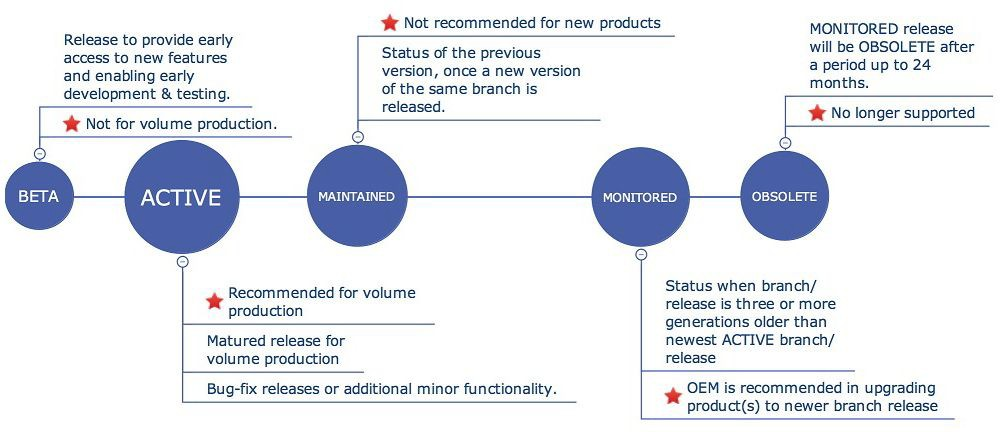

# Security Expiration Date

*The manufacturer shall be transparent about the period of time that security updates will be provided. Like a manufacturer’s product warranty, there shall be transparency around the support period of security updates.*

Manufacturers should provide details about product support at various stages and publish security expiration dates. Z-Wave’s Protocol Lifecycle provides an example.

The Lifecycle details in what phases updates will be applied, and to what product branch. For details on the various phases and how the lifecycle is implemented for specific Z-Wave products, see:

[https://www.silabs.com/products/development-tools/software/z-wave/embedded-sdk/life-cycle](https://www.silabs.com/products/development-tools/software/z-wave/embedded-sdk/life-cycle)
