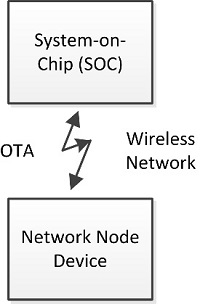
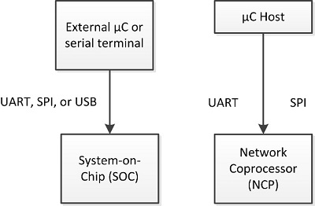

# Introduction

The bootloader is a program stored in reserved flash memory that can initialize a device, update firmware images, and possibly perform some integrity checks. Firmware image update occurs on demand, either by serial communication or over the air. Production-level programming is typically done during the product manufacturing process yet it is desirable to be able to reprogram the system after production is complete. More importantly, it is valuable to be able to update the device's firmware with new features and bug fixes after deployment. The firmware image update capability makes that possible.

Silicon Labs supports devices that do not use a bootloader, but this requires external hardware such as a Debug Adapter (Silicon Labs ISA3 or Wireless Starter Kit (WSTK)) or third-party SerialWire/JTAG programming device to update the firmware. Devices without a bootloader have no supported way of updating the firmware once they are deployed, which is why Silicon Labs strongly advocates implementing a bootloader.

In March of 2017, Silicon Labs introduced the Gecko Bootloader, a code library configurable through Simplicity Studio’s IDE to generate bootloaders that can be used with a variety of Silicon Labs protocol stacks. The Gecko Bootloader can be used with EFM32 and EFR32 Series 1 and later devices. The Gecko Bootloader was restructured into a component-based design and released with Gecko SDK Suite (GSDK) 4.0 in December of 2021. This new version is documented in [Silicon Labs Gecko Bootloader User's Guide for GSDK 4.0 and Higher (series 1 and 2 devices)](https://docs.silabs.com/mcu-bootloader/latest/bootloader-user-guide-gsdk-4/) or [Silicon Labs Gecko Bootloader User’s Guide for Series 3 and Higher](https://docs.silabs.com/mcu-bootloader/latest/bootloader-user-guide-series3-and-higher/), along with other documents. Documentation for older versions is installed with their respective SDKs.

The Gecko Bootloader uses a customized update image file format. The update image file consumed by a Gecko Bootloader-generated application bootloader is a GBL (Gecko BootLoader) file, and is described in [Silicon Labs Gecko Bootloader User's Guide for GSDK 4.0 and Higher (series 1 and 2 devices)](https://docs.silabs.com/mcu-bootloader/latest/bootloader-user-guide-gsdk-4/) or [Silicon Labs Gecko Bootloader User’s Guide for Series 3 and Higher](https://docs.silabs.com/mcu-bootloader/latest/bootloader-user-guide-series3-and-higher/).

Bootloading a firmware update image can be accomplished in two ways. The first is Over-The-Air (OTA), that is, through the wireless network, as shown in the following figure.

The second is through a hardwired link to the device. The following figure represents the serial bootloader use cases for SoCs (System on Chips) using either a UART (Universal Asynchronous Receiver/Transmitter), SPI (Serial Protocol Interface), or USB (Universal Serial Bus) interface, and for NCPs (Network Coprocessors) using either UART or SPI.

Silicon Labs networking devices use bootloaders that perform firmware updates in two different modes: standalone (also called standalone bootloaders) and application (also called application bootloaders). Application bootloaders are further divided into those that use external storage for the download update image, and those that use local storage. These bootloader types are discussed in the next two sections.

The firmware update situations described in this document assume that the source node (the device sending the firmware image to the target through a serial or OTA link) acquires the new firmware through some other means. For example, if a device on the local Zigbee network has an Ethernet gateway attached, this device could get or receive these firmware updates over the Internet. This necessary part of the firmware update process is system-dependent and beyond the scope of this document.

## Standalone Bootloader

A standalone bootloader is a program that uses an external communication interface, such as UART or SPI, to get an application image. Standalone firmware update is a single-stage process that allows the application image to be placed into flash memory, overwriting the existing application image, without the participation of the application itself. Very little interaction occurs between the standalone bootloader and the application running in flash. In general, the only time that the application interacts with the bootloader is when it requests a reboot into the bootloader. Once the bootloader is running, it receives firmware update packets containing the (new) firmware image either by physical connections such as UART or SPI, or by the radio (over-the-air).

When the firmware update process is initiated, the new code overwrites the existing stack and application code. If any errors occur during this process, the application cannot be recovered, and the process must start over. For information about configuring the Gecko Bootloader as a standalone bootloader, see [Silicon Labs Gecko Bootloader User's Guide for GSDK 4.0 and Higher (series 1 and 2 devices)](https://docs.silabs.com/mcu-bootloader/latest/bootloader-user-guide-gsdk-4/) or [Silicon Labs Gecko Bootloader User’s Guide for Series 3 and Higher](https://docs.silabs.com/mcu-bootloader/latest/bootloader-user-guide-series3-and-higher/).

## Application Bootloader

An application bootloader begins the firmware update process after the running application has completely downloaded the update image file. The application bootloader expects that the image either lives in external memory accessible by the bootloader or in a portion of main flash memory (if the chip has sufficient memory to support this local storage model).

The application bootloader relies on the application to acquire the new firmware image. This image can be downloaded by the application in any way that is convenient (UART, over-the-air, etc.) but it must be stored into a region referred to as the download space. The download space is typically an external memory device such as an EEPROM or dataflash, but it can also be a section of the chip’s internal flash when using a local storage variant of the application bootloader. Once the new image has been stored, the application bootloader is then called to validate the new image and copy it from the download space to flash.

Since the application bootloader does not participate in acquiring the image, and the entire image is downloaded before the firmware update process is started, download errors do not adversely affect the running image. The download process can be restarted or paused to acquire the image over time. The integrity of the downloaded update image can be verified before initiating the firmware update process, to prevent a corrupt or non-functional image from being applied.

The Gecko Bootloader can be configured to accept a list of multiple upgrade images to attempt to verify and apply. This allows the Gecko Bootloader to store what is in effect a backup copy of the update image, which it can access if the first image is corrupt.

Note that the EmberZNet NCP platform does not utilize an application bootloader because the application code resides on the host rather than on the NCP directly. Instead a device acting as a serial coprocessor would utilize a standalone bootloader designed to accept code over the same serial interface as the expected NCP firmware uses. However, the host application (residing on a separate MCU from the NCP) can utilize whatever bootloading scheme is appropriate.

For more information on application bootloaders, see [Silicon Labs Gecko Bootloader User's Guide for GSDK 4.0 and Higher (series 1 and 2 devices)](https://docs.silabs.com/mcu-bootloader/latest/bootloader-user-guide-gsdk-4/) or [Silicon Labs Gecko Bootloader User’s Guide for Series 3 and Higher](https://docs.silabs.com/mcu-bootloader/latest/bootloader-user-guide-series3-and-higher/).
